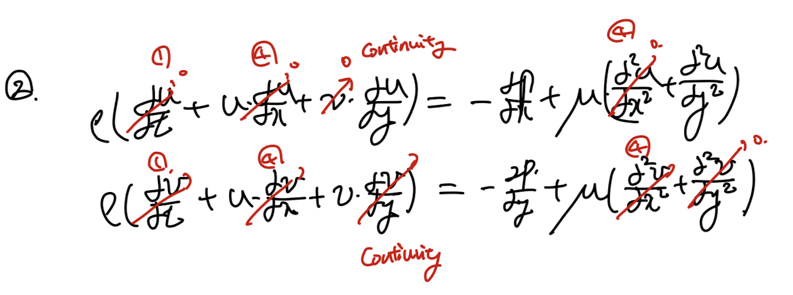
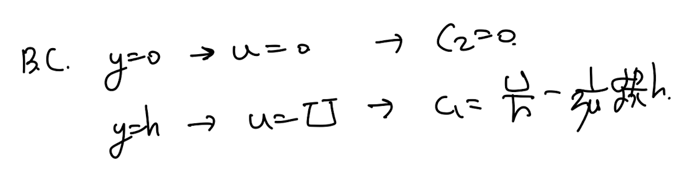
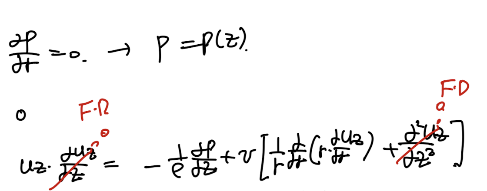
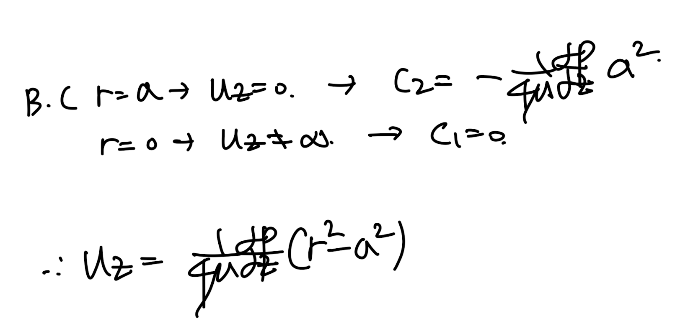
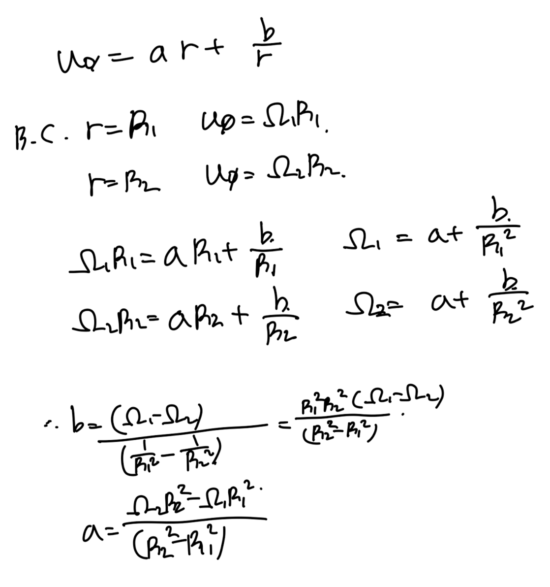
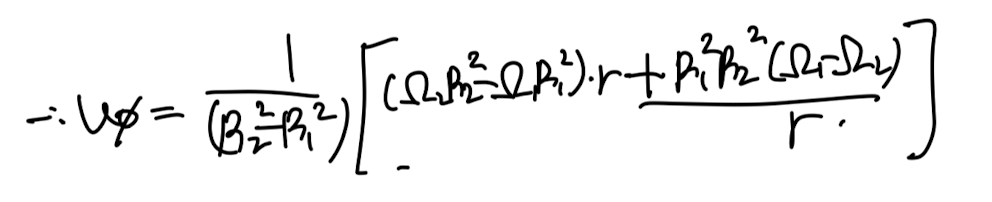
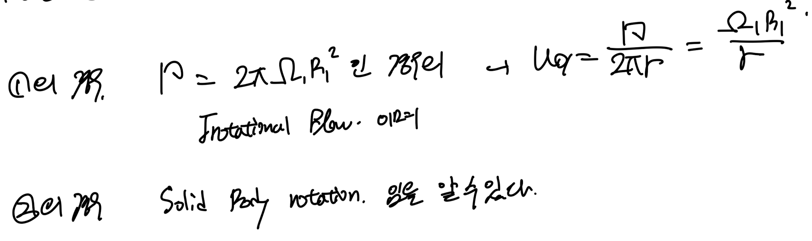
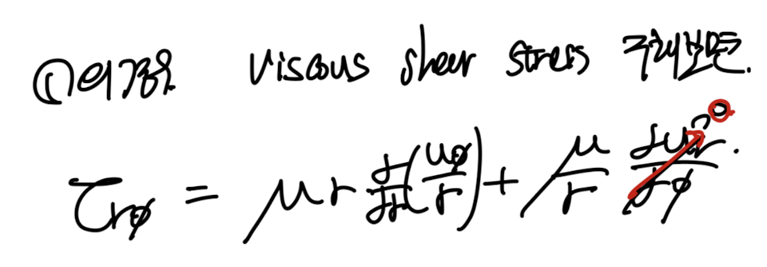
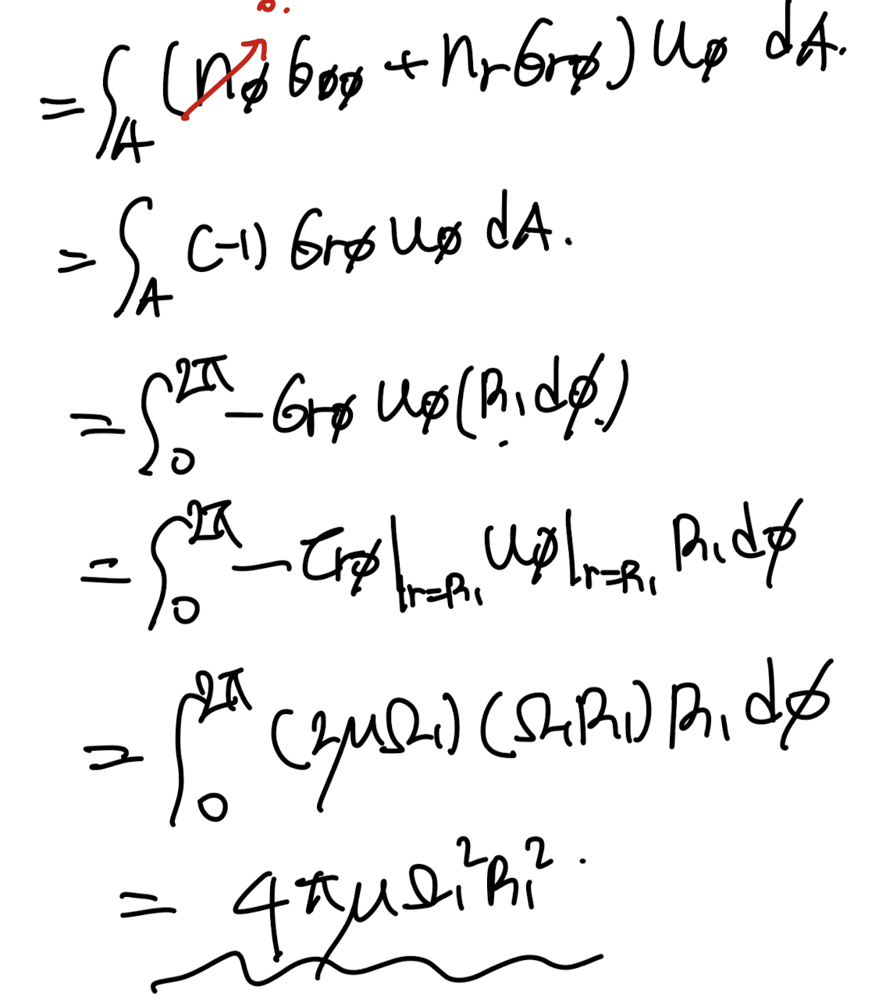

Source: [https://jeffdissel.tistory.com/m/127](https://jeffdissel.tistory.com/m/127)

Ch4 Laminar Flow
Reynolds number 가
critical Number(상황별로 다름) 보다 작게되면,
유체가, smooth한 path로 일정하게 흐르는,
다시말해 섞이지 않고 uniform하게 흐르는
Laminar flow의 형태를 띄게 된다.

[Laminar flow]
follow smooth paths in layers,
with each layer moving smoothly past the adjacent layers
with little or no mixing
여기서 우리는
-plate 사이를 흐르는 Laminar flow
-Tube 안을 흐르는 Laminar flow
-Rotating cylinder 안의 Laminar flow
를 수학적으로 분석해보자.
----------------
사실 유체의 흐름을 수학적으로 해석하는 방법은
생각보다 단순하다.
질량보존
모멘텀 보존
에너지 보존
이 3가지 식중 대부분 질량, 모멘텀 보존으로부터
수학식의 유도를 시작하기 때문이다.
----------------
Case1
Plate 사이에 유체가 흐르고, 위 plate 는 일정한 속도 U로 x방향으로 움직임.
(u는 x방향 속도, v 는 y방향 속도라고 하자)

[Assumptions]
-Incompresible 2D flow.
- Non-zero x direction pressure gradient
-No slip boundary condition(y = 0)
-Fully developed (du/dx = dv/dx = 0)
-Steady flow ( d()/dt = 0)
먼저 연속방정식을 통해서, v = 0임 을
아래와 같이 증명할 수 있다.

이후 모멘텀 보존 방정식
= Incompressible Navier's Stokes Eq.
에 가정들 + v = 0 을 적용하면,

간단한 두 식만 남게 된다.

u = u(y) 이므로 (fully developed Assumption)
y에 대한 2차 ODE를 풀어주면 다음과 같다.

##위의 ODE의 계수는 BC로 유도하였다

----------------
아주 간단한 문제였고,
이번에는 tube 안을 흐르는
Laminar flow 를 분석해보자.
Case2

Laminar flow inside of a cylinder.
[Aussumptions]

먼저 연속방정식 - Cylindrical coordinate
에 가정들을 적용 시켜주자.

여기서 최종식을 풀기 전에 핵심은
u_r = ur(r) 즉, z와
φ와 independent 하다는 것이다.
(fully developed axissymmetric 가정)
이 사실을 인지하고 위 식을 풀어준후,
no slip bc 를 적용시켜주면,
u_r = 0 이 나온다.

결론적으로 u는 z방향 만 존재한다는 것,

##햇갈리면 안되지만,
u_z = u_z(r)
라는 것은 위에서 언급했던 이유와 동일하다.
다음은 아까 plate와 동일하게
모멘텀 보존 식에 가정을 대입해주자.

3식이 차례대로 다음과 같이 정리된다.

똑같이 u_z를 r에 대해서 적분한후, BC를 대입해주어 계수들을 구해주자.

최종적으로 u_z 는 다음과 같다.

----------------
Case3
Steady flow이며 같은 중심에서 회전하고 있는
두개의 rotating cylinder 사이에 있는 유체의 흐름을 분석해보자.

Steady flow between concentric rotating cylidners
[Assumptions]

실린더 coordinate에서 해석할 것이고,
2D, Steady, incompressible axissymetric 가정이 포함되어 있다.
이제 연속방정식, 모멘텀 보존 방정식에 적용해보자.
모두 적용시켜보면, 3가지 식이 나오게 되며,

먼저 똑같이 u_r = 0이 나오게 된다.
(r = 0 일때, 속도가 무한으로 가는 것은 불가능 하므로)

그다음 모멘텀 보존 방정식에서,
r^m으로 해를 가정한후, 일반해를 구하면 다음과 같다.

회전하고 있는 cylinder 면에서의 속도를
Boundary condition으로 알고 있기 때문에,
계수 a,b,는 다음과 같다.

따라서, 최종 Velocity를 r에 관한 함수로,
다음과 같이
두개의 cylinder의 각속도와 각 중심으로부터 반지름으로
유도가능하다.

여기서 식을 두가지로 나누어서 살펴보자.

재밌는 것은 두가지 경우 우리가 모두 배운
상황이라는 것이다.
Case1 - Irrotational flow
(circulation - constant 이므로)
Case2 - Rotating solid body.

1번의 경우를 조금더 자세하게 viscous shear stress, dissipation rate까지 구해보자.
먼저 viscous shear stress는 속도장을 우리가 알고 있기 때문에,
간단하게 구할 수 있다.
(조심할것, cylindrical coordinate)

shear stress - > surface force ->
The rate of work done by the clinder을
유도 할 수 있다.

여기서 tensor notation을 잘 분석해야 하는데
먼저 속도자의 경우 u_
φ 만 존재함을 배웠었다.
따라서, j = φ만 고려해준다.
이후,

여기서, control surface의 벽면의 법선 벡터는
n = (-n_r, 0, 0) - cylindrical coordinate
임을 알 수 있다.
(R_2 - infinity 이므로,
control surface는. 안쪽만 존재한다)

따라서, i = r일때만 고려해준다.
하지만 n_r = -1임.

따라서, 정리하면, the rate of work by the cylidner
는 다음과 같다.
이후, dissipation rate를 유도해보면 (Ch3에서 다룸.)

이후, 적분을 통해서 total dissipation 을 구할 수 있다.

핵심은
The rate of work by the cylinders
= total dissipation
과 같다는 것이다.
결국, 유체가 하는 일률은 전부 점성으로 인해서,
Mechanical E -> Thermal E로 소산된다는 것이다.
지금까지 Laminar Flow를
수학적으로 속도장을 유도하였고,
-Plate
-Tube
-Rotating cylinders
의 경우로 나누어서 살펴 보았다.
Laminar flow이기 때문에,
위의 가정들이 적용되며, 일정한 흐름을 같기 때문에
수학적으로 분석이 가능하다는 생각이 든다.
