Source: [https://jeffdissel.tistory.com/239](https://jeffdissel.tistory.com/239)

Ch2에서 다루었지만, 확률의 개념은 Two Concepts.
1. Frequentist
확률 = 무한 반복 실험에서 사건이 일어나는
장기 상대도수(long-run frequency)
예: 동전을 무한히 던졌을 때 앞면이 나올 비율이 0.5라면, 그게 “확률 0.5”의 의미.
파라미터(θ)는 고정된 값
, 확률 개념을 적용하지 않음.
2. Bayesian
확률 = 어떤 사건이나 파라미터에 대한 **불확실성(uncertainty)**을 수치로 표현한 것.
파라미터 θ 자체도 확률변수로 취급.
데이터를 보기 전에는
prior, p(θ)
로 불확실성을 표현
데이터를 본 후에는
posterior p(θ∣D)
로 업데이트.
즉, Frequentist는 prior이란 개념을 사용하지를 않고,
그냥 Data D를 가지고 확률을 정의한다.
(무한히 동전을 던졌을때 앞면이 나온 횟수 / 전체 던진 횟수 = 앞면이 나올 확률)
여기서 Bayesian은 Prior의 개념을 이용하고, Dataset과 의 조합으로 Posterior을 구한다.
쉽게 말해,
동전의 앞면이 나올 확률 = 1/2 라는 사전 믿음을 전제
하고,
앞으로의 data를 추가하여, 그 posterior를 구하는 것.
여기서 Bayesian은 아주. 아주 큰 장점이 있다.
우리가 어떤 동전을 던졌고,
그 동전이 앞인지 뒤인지 예측하는 모델을 구했다고 해보자.
여기서 모델은, 앞면/뒷면 인지는 예측 할 수 있지만,
그 예측이 얼마나 불확실한지는 알려주지 않는다.
In statistics, modeling uncertanity about parameters using a
probability distribution -> is known as
Inference
.
여기서 우리는 Posterior Distribution을 활용하여, Uncertanity를 구할 것.
Posterior을 구하는 식은 다음과 같다.

Prior
= 데이터 이전의 믿음
Likelihood
= 특정
θ
가 데이터와 얼마나 잘 맞는지
(이것만 기억하자, Prior 데이터를 반영하기 이전의 확률값이 - prior)
#Conjugate Prior

if

(F: type of Expotential Family, 아래 링크에서 자세히 설명)
https://jeffdissel.tistory.com/233
쉽게 말해 prior과 Posterior 두개 확률 분포 form이 같다면 -> conjugate prior
동전 던지기로 예를 들어보자.
총 N번 동전을 던졌다. n번째 사건에서
yn = 1 이면 동전이 head,
yn = 0 이면 동전이 tail
N번 던지고 총 결과를 Dataset D에 다음과 같이 저장.
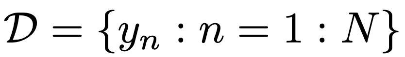
여기서 확률은
Bernoulli Distribution

theata: 앞면이 나올 확률
여기서, 매 사건은 독립적이므로,
likelihood
는 다음과 같이 정의된다.

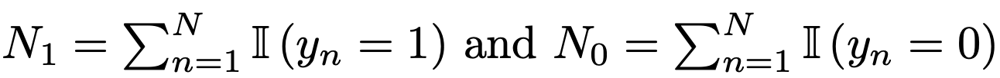

여기서 새로운 모델의 정의를 살펴보자.
Binomail model - N번 던졌을때 y번 head가 나올 확률.

자, 여기서 우리는
Conjugate prior
이라고 가정하여,
즉, 다음과 같이 Likelihood와 같은 form이라고 하자 (Beta distribution form)
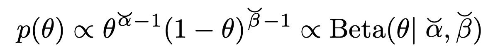
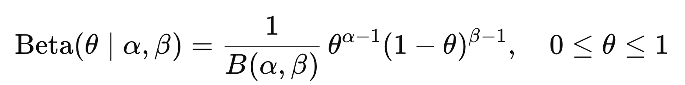

ch2에서 다룬, Definition of Beta distribution
따라서,
prior * likelihood -> posterior
이므로, posterior이 다음의 beta분포임을 알 수 있다.

# pos terior predictive
이제 주어진 데이터로 new y를 띌 확률이 얼마인지 계산하는 것.
위 Bernoulli model같은 경우 우리는, posterioral, 그리고 beta distribution을 알기 때문에,

Note. 동전 앞이 나올 확률이므로 그냥 theat이다.
#Mixtures of conjugate priors

이전까지 우리는 prior을 하나의 beta함수로 표현한 예시만 들었지만,
gaussian subgroup으로 나누어 그 합으로 표현하듯이,
conjugate prior도 여러개의 합으로 위와 같이 표현할 수 있다.
#Dirichlet-multinomial model
지금까지는 베르누의 모델만 봤다면, 이제는 주사위와 같은 categorical distribution
을 살펴보자.

주사위 면 c개 있고, index: c가 나올 확률 theat_c
여기서 likelihood는 독립적인 확률을 곱해주어 표현하자.

우리는 likelihood와 동일한 expoential family에 있는 prior을 설정해야한다.
따라서, likelihood가 속해있는
Dirichlet Distribution
의 정의를 살펴보자.

위 정의에 필요한,

Probability Simplex

multivariate beta function
이제 posterior을 likelihood와 prior의 곱인 다음의 표현으로 살펴보자.

#Gaussian - Gaussian Model (univariant)
이번에는 가우시안 분포를 살펴보자, univariate일때 Likelihood는 다음과 같다.

여기서 같은 family로 prior을 정의하면, 다음과 같이 평균과 분산을 미지수로 설정하자.
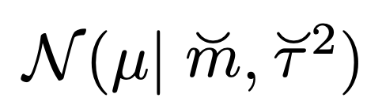
prior Gaussian Distribution
이때, 두 pdf의 곱으로 새로운 Gaussian distribution을 정의하면,
지수항을 더하여 새로운 Gaussian form으로 강제로 만들어 주면 다음의 Posterioral의 평균과 분산을 구할 수 있다.
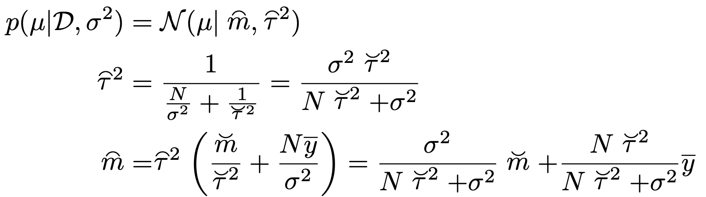
즉, 쉽게 말해서 Prior과 likelihood의 결합으로 posterioral이 형성이 되는데,
그 posterioral에 영향을 주는 정도가 분산으로 나타난다.
(b)는 prior의 분산이 커 posterial에 주는 영향이 작음을 알 수 있다.
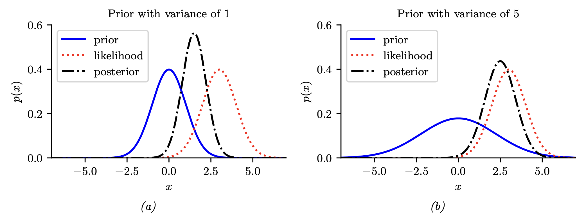
#Gaussian - Gaussian Model (Multivariant)
(우리는 ch3에서 전부 다룬 여러 pdf를 하나씩 prior likelihood, posterioral을 작성해보는 중이다)
이번에도 ch3에서 배운 다변수 가우시안 분포를 살펴보자.

Likelihood of MGM
Prior has to be in the same Family, Multivariant Gaussian Distribution
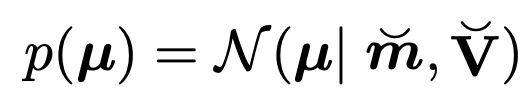
Prior distribution
ch3에서 수학적으로 다룬 내용이므로, 결과만 작성하면,
Posterioral 의 평균과 분산은 다음과 같다.

밑의 예시가 정확히 우리가 무엇을 하고있는 지를 보여준다.
Prior은 정직한 Multivariant Gaussian distribution이라고 설정하고,
Data를 우리가 가지고 있을때, posterial(prior based model)을 추론 할 수 있다.

#Hierarichal priors
posterial을 구하기 위해서, p(theat) - prior을 정의해야한다.
이때 prior정의를 위해 필요한 파라메터를 새롭게 정의할 수 있다.
ξ: hyperparameter
따라서, 다음의 계급적 순서가 생기게 된다.
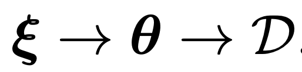
그리고, 확률분포는 다음과 같이 bayes rule사용.
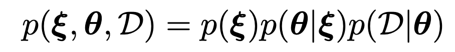
이를 MAP문제에 적용하면, -> 최적의 hyperparameter를 찾는 문제로 전환할 수 가 있다.
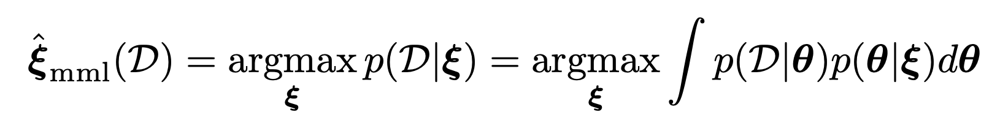

여기서 재미있는 사실은, 최적의 hyperparameter를 찾기 위해서 Data를 사용한다는 사실이다.
즉, prior의 정의자체가 data가 이전의 순수한 믿음인데,
Data를 이용하여 정의한다는 점이 역설적이다.
(실제로 정확한 posterial을 얻기 위해서, Data를 미리 보는 컨닝을 하는 느낌)
(called Empirical Bayes(EB))
따라서, 우리는 loglikelihood를 최적화하는 변수와 방법이 여러가지가 있다는 것을 지금까지 확인하였다.

