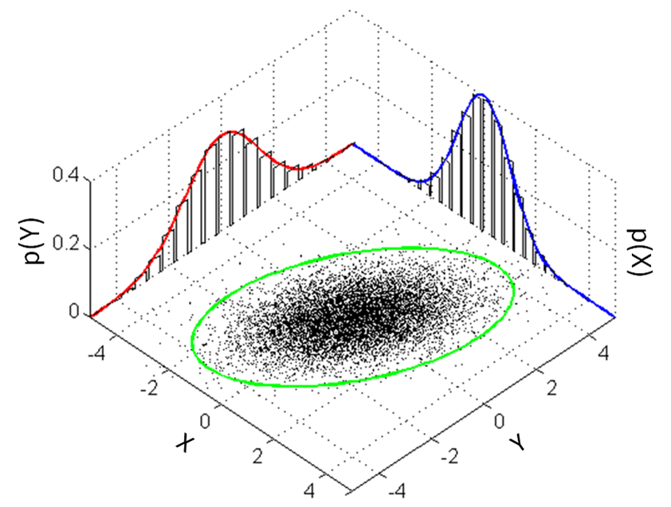
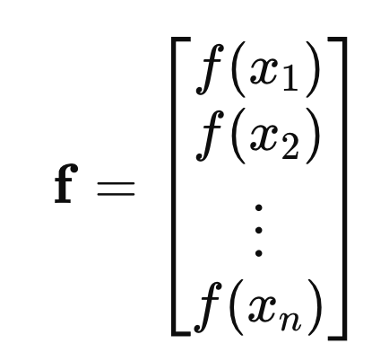
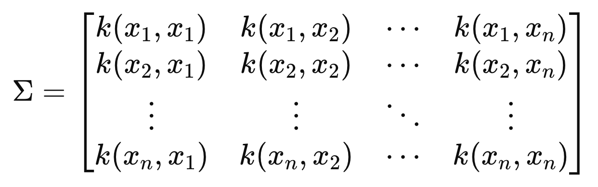
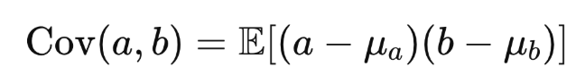
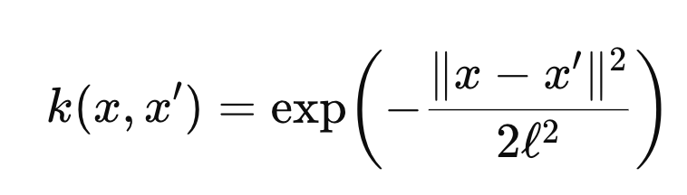
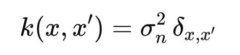
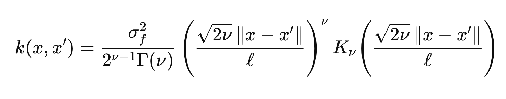

Source: [https://jeffdissel.tistory.com/217](https://jeffdissel.tistory.com/217)

우리가 지금 하고자 하는 것은??
"어떤 입력 X 가 주어졌을 때, 대응하는 출력 y 는 무엇일까?"
일반적인 회귀(regression)
y=f(x)+ϵ
형태에서 “함수
f(x)
자체”를 특정 모델(선형식, 신경망 등)로 가정.
(목표 x -> y)
하지만 Gaussian Process Regression 은
다르게 접근
함수
f ( x )
를
확률적 객체
(random function)로 보고,
"f(x)를 특정한 함수 모양으로 딱 정하지 않겠다.
대신, 가능한 모든 함수들을 후보로 두고,
그 함수들 중에서 '정규분포적인 성질' 을 가진 집합을 고려하겠다."
==========================================
여기서부터 이해하기 굉장히 어렵다.
크게 두가지만 딱 기억한다 생각하고 들어가보자.
1. 강력한 가정 (Multivariant Normal distribution)
2. Kernel Function.
이 두가지만 설명할 수 있다면, 이해 완료 참잘했어요 스탬프.
==========================================
1. Important Assumption in the Gaussin Process
(다변량 정규분포, Multivariant Normal Distribution)

What is 다변량 정규분포???
: Multivariate Normal Distribution
두가지 핵심을 기억하자.
d개의 변수가 있을때 (X1 ... Xd)
1. X1,X2, .... Xd 모두 정규분포를 띄고,
2.
임의의 선형결합 Y 또한 정규분포를 띈다면,

{X1,X2, .... Xd}는 다변량 정규분포를 띈다고 정의한다.
밑의 그림은 다변량 정규분포를 띄는 {X,Y} 예시이다.

서로 다른 변수 X,Y 각각의 정규분포를 (빨, 파)그래프로 알 수 있다.
(X,Y) 벡터를 점으로, 2차원 공간에 점을 찍어보면
타원의 boundary안에 점들이 찍히고,
가운데에 가장 많이 찍히는 것을 알 수 있다.
(타원 바깥은 매우 적은 점들)
이말은 즉 X, Y의 선형결합이 정규분포를 띈다는 의미이다.
X+Y의 합이 아주 크거나 작은 값들은
타원 바깥에 존재 즉 매우 적은 case
반대로 x1+x2 = 중앙값은 굉장히 많이 존재하여
타원 중앙에 촘촘히 존재
한발짝 더 나아가서, 다른 예시로 살펴보자.
X - height, Y - weight 의 예시로 이해해보자.
사람 500명을 선정한다음에, (키, 몸무게)를 조사하고 점으로 찍어보자.

위와 같이 타원의 boundary안에 점이 찍히는 것을 알 수 가 있다.
그리고 타원의중앙점에 점들이 모여있는 것 을 알 수 가 있다.
즉, 키와 몸무게의 선형결합은 정규분포를 띔을 알 수 있고,
그러기에 {키, 몸무게}는 정규분포를 띈다고 할 수 있다.
#여기서 한가지 짚고 넘어가자.
다시 본론으로 돌아와서,
Gaussian Process 는
함수 f(x) 를 랜덤 변수들의 집합으로 보고,
입력점들을 모았을 때 항상 **joint Gaussian (다변량 정규분포)**을 따른다고 가정
(f(x1), f(x2) .. f(xn) 모두 각각 정규분포를 따르고,
선형결합도한 정규분포를 따른다고 가정한다는 말임)
예를들어 n개의 parameter가 있다고 가정하자.

그때 대응하는 함수값을 벡터로 표기하면,

자 이제
'함수벡터가, 다변량 정규분포를 따른다'
를 수학식으로 표현하면

여기서 u는 평균벡터
sigma는 커널함수로 구성된 공분산행렬이다.

대각 성분 -> 분산
비대각 성분 -> 공분산
맨처음에 중요하다고 했던 두번째 커널함수가 드디어 등장하였다.
우리가 Gaussian Process Assumption을 한 이유는,
공분산을
수학적으로 모델링
을 할 수 있기 때문이다.
즉, 서로다른 변수 x,x'이 있을때,
함수들의 공분산을 우리는 커널함수로 정의한다.

맨처음에 우리의 목표는. X = {x1,x2 ... xn} -> Y = f(x)를 도출 하는 것이었다.
즉, 위 해답을 알 기 위해서 우리는
x1,x2 ... xn 들이 바뀔때,
그 함수값(f(x1)... f(xn))들은 같은 방향으로 바뀌는지,
다른 방향으로 바뀌는지 혹은 안바뀌는지를 알아야 한다.
그 변화의 방향성을 정량화한 값이 공분산이고,
이를 함수로 표현한 것이 커널 함수이다.
#공분산의 정의

따라서, 밑의 커널함수의 식을 말로 표현해보자.
(수학식은 장황한 말의 표현을 압축하고 있다)

x1,x2의 함수값의 변화경향성 -> 공분산 -> 커널함수
여기서 다양한 커널함수 모델이 존재하고,
대표적인 모델들부터 하나씩 살펴보자.

특징
: 입력이 가까우면 함수값도 비슷하다. 멀어지면 상관성이 줄어든다, 매끄러운 함수가정.
Matern Kernel

(Kv: Bessel function)
특징
: RBF보다 덜 매끄러운 함수도 가능하게 한다(for Non linear cases)
물리적 현상(거친 데이터, 노이즈 많은 데이터)에 잘 맞음.
Periodic Kernel

특징
: 데이터가 주기성을 가진다고 가정.
(더 많은 커널 함수들은 밑의 파이썬 코드 예제에서 더 설명~)
kernel을 선정한 후에, 가지고 있는 데이터들을 활용하여 training을 진행하여,
커널 내부의 하이퍼파라미터
(
ℓ
: length scale,
σ2
: variance 등)
을 결정한다.
(최종적으로 밑의 공분산행렬을 다 완성시킬 수 있다는 말임)

이제 새로운 변수 x*를 입력으로 받았을때,
존재할 수 있는 f(x*)의 평균과 분산을 얻을 수 있게 된다.

이게 가장 큰 GP의 장점이다. 즉,
우리는 어떤 특정 output을 도출 하는게 아니라
확률변수로 output을 도출한다.
==========================================
Python 코드로 간단하게 어떻게 활용하는지 살펴보자.
일단 데이터를 정규화 시켜주고, test, train split으로 분리해준다.

그다음, kernel을 어떤 커널함수를 사용할지를 정해야한다.
(커널을 이것저것 활용하여 결과를 뽑아보고, 가장 신뢰도가 높은 결과를 보는 커널로 선정해야한다)

1. Constant Kernel

[hyper parameter]
σ f 2 ​ (constant value): 함수 값의 전반적 스케일(분산) 조절.
2. RBF

[hyper parameter]
ℓ
(length scale): 거리에 따른 상관의 감소 속도.
3. White Kernel

Kronecker delta
[hyper parameter]
σn^2 ​
(noise_level): 관측 잡음의 분산.
4. Matern

[hyper parameter]

(RBF의 길이 척도에다가, 함수의 부드러움을 상수로 더한 case, v-> inf이라면 RBF와 동일)
위 커널들을 조합하여 하나의 커널을 형성한다.
보통 가장 많이 쓰이는 조합이.
Constant Kernel * (RBF / Matern) + WhiteKernel
이후에 이제 모델을 train data로 학습하면, 하이퍼 파라메터들이 결정이 된다.

학습된 모델에 test data를 넣어 정확도를 score로 계산.

이제 모델이 학습되었다면, 이 모델에 임의의 데이터를 넣어서
Sobol Sentivity 즉 민감도 지수를 추출 할 수 있다.
(정확히 어떤 알고리즘으로 민감도지수를 추출하는지는.. 다음블로그)

==========================================
여기까지가 GRP에 관한 내용이고,
이 GRP가 어떻게 활용되는지 간단하게 이야기하고 마무리하도록 하자.
GRP도 결국에는 데이터들사이에서 어떠한 규칙을 발견하여
새로운 데이터는 어떤 output을 도출하는지를, 규칙을 토대로 결정하는 방식이다.
즉,
머신러닝 =
“데이터로부터 규칙을 학습하는 모든 기법” 에
GRP는 포함
된다.
그중에서, Supervised Learning(지도학습)
: 어떠한 데이터 - 정답 pair을 알고 있는 상황에서,
이를 활용하여 모델을 학습하는 방식.
이라고 할 수 있다.
