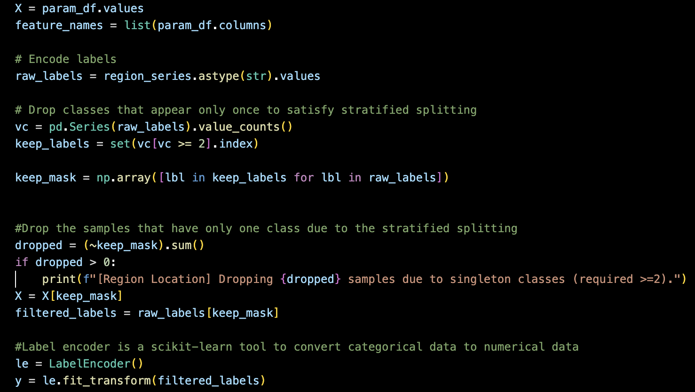
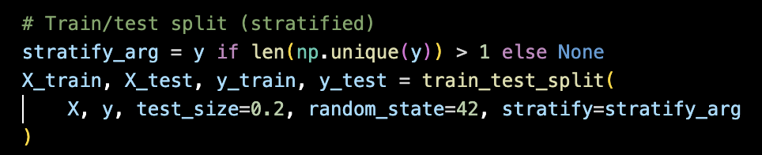
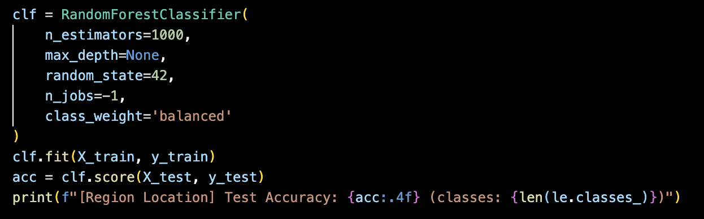
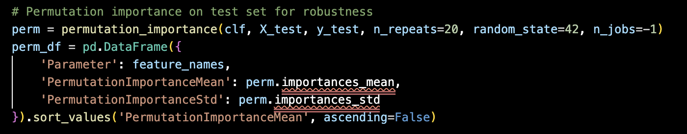
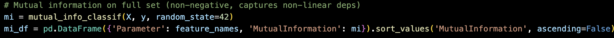

Source: [https://jeffdissel.tistory.com/216](https://jeffdissel.tistory.com/216)

랜덤 포레스트
는 분류, 회귀 작업을 하기 위한 가장 classic 하고 강력한
방법이다. 바로 설명을 시작해보도록 하겠습니다.

just a tree

Decision Tree
[Wikipedia]
Decision Trees split data step by step, like asking a series of yes/no questions.
decision tree는 아주 간단하게, 각 노드마다 질문이 있다고 생각을 하면,
질문의 yes는 오른쪽, no는 왼쪽 이런식으로
가지치기로 수많은 데이터들을
분류 or 회귀
하는 방식.
하지만 과적합, large variation 이라는 단점.
- A single decision tree can overfit the training data.
- Small changes in the dataset may produce a completely different tree.
(# training 단계가 우리는 (알고있는 정답과 - 데이터 pair)을 통해서
각 노드마다 어떤 질문이 들어와야하는 지를 학습하는 단계라는 사실을 인지 해야함.
그렇기에 학습하는 데이터가 질문을 직접적으로 결정하므로,
학습하는 데이터에 따라 tree가 천차만별이라는 말임.)

forest - a lot of trees.
Random Forest solves these problems by growing
many different trees
and then combining their predictions.
그렇기에 우리는 한개의 tree만 쓰는게 아니라 수많은 tree를 사용하여,
어떤 결정을 하므로써 과적합 문제를 방지함.
'예를들어서 어떤 중요한 사항을 여러 정치인들이 결정을 하게 되면,
다양한 관점에서 최종결정을 할 수 있음.
하지만, 회의장에 진보 or 보수 정치인들만 있다면,
당연히 진보 or 보수 성향의 최종결정이 될 것'

Random Forest
즉 수많은 tree를 제작한다음에 모든 tree각각 학습을 시킨다.(질문을 생성)
이후에, 새로운 데이터 set이 왔을때, 각각 tree에서 서로다른 결과가 나올 것.
분류는 -> 과반수로 가장 빈번한 결과를 최종적으로 선택
회귀 -> 각 결과의 평균값을 선택.
하여 최종값을 결정하는 방식입니다.
뭐든지 예시를 들면서 살펴보아야,
이해가 가장 빠르기 때문에 예시로 자세한
과정을 살펴보자.
Imagine we have a dataset of many patients.
입력 데이터 (features):
나이, 성별, 흡연 여부, 혈압, 운동 습관, 가족력, 직업
정답 (label):
암 발병 위험도 (1~6 단계, 6이 가장 심각)
0. Set the Goal
우리는 환자의 암발병 위험도를 측정하고 싶다고 가정하자.
1. Prepare the Data.
환자 10,000명의 데이터가 있다고 가정하고 각 데이터에는
환자마다 "
특징
(나이, 성별, 흡연 여부, 혈압, 운동 습관, 가족력, 직업)" 값들이 있고,
그에 대응되는 "
라벨 or 정답
(1~6 위험도)" 가 존재.
2. Determine the subset from the Data.
전체 데이터에서
무작위로
환자들을 뽑아
부분 데이터셋
을 만든다.
(복원추출이므로, 같은 환자가 여러 번 뽑힐 수도 있고, 아예 빠질 수도 있음)
예를 들어,
Tree 1은 환자 7,000명 샘플로 학습
Tree 2는 환자 6,800명 샘플로 학습
Tree 3은 환자 7,200명 샘플로 학습 …
이렇게 각각 다른 데이터를 본
수백 개의 트리
가 만들어짐.
(트리 갯수는 유저가 정함 - hyper parameter)
(requires large computation)
3. Important Feature to consider on each node in each Tree.
일단 각 Tree는 하나의 root Node부터 시작!!!!
여기서 아주 아주 중요한 점은
학습하는 과정에서
새로운 노드들이 생성
이 되는데,
노드들마다 feature에 대한 질문을 생성할 것이다.
(예를들어, 흡연빈도 > 주 5일) 이런식으로,
하지만, 중요한 점은 모든 특징 consider x
e.g) 한 노드에서 “흡연 여부 + 나이 + 운동습관”만 고려해서 분할을 결정
다른 노드에서는 “성별 + 혈압”만 보고 결정.
-> 이렇게 하면 각 트리가
조금씩 다른 관점
을 가지게 되어 다양성이 확보가능.
(한개의 트리 내부에서 노드들마다 고려하는 특징이 다르다는 것)
(THE MOST IMPORTANT STAGE)
4. Training Stage
(편의상 하나의 트리의 과정을 살펴보자, 실제로는 동시다발적으로 여러트리들이 학습)
현재까지 각 트리마다 랜덤 데이터셋을 부여받았다.
우리의 목표는 현재 데이터셋을
최대한 같은 라벨들끼리
현다른 가지들로 묶어서 분리하는게 목표.
즉, 각 노드마다
질문들을 아주 잘 만들어야 하는데,
그 질문들을 만든 방식은
분류 문제 →
불순도(impurity)
감소량으로 평가
대표적인 지표:
지니 불순도(Gini impurity)
,
엔트로피(Entropy)
회귀 문제 →
분산(variance)
감소량으로 평가
(쉽게 말해, 나눈 뒤에 두 그룹이
“더 비슷한 위험도를 가진 환자들끼리 모이게 되는가?”
-> Node Purity
를 수치로 계산하는 것)
이런식으로 모든 트리에 대해서,
하나의 노드로 시작해서, 전체가 잘 분리될때까지,
노드들을 생성하고(가지치기),
각 노드마다 질문을 생성.
이렇게 Node Purity 가 특정 threhold라면.
학습 종료.
5. Put the new patient data that we wanna get the output.
이제 새로운 환자 데이터(예: 55세, 남성, 흡연자, 고혈압, 운동 부족) 투입.
(위 학습된 모델에)
Tree 1: 위험도 5 예측
Tree 2: 위험도 6 예측
Tree 3: 위험도 4 예측
Tree 4: 위험도 6 예측
Tree 5: 위험도 5 예측
Tree 6: 위험도 5 예측
Tree 7: 위험도 5 예측
...
최종 결과: 다수결로 위험도 5가 최종 예측값
(회귀 문제라면 단순 평균을 내서 예측값을 산출)
자 이제 위 작업을 파이썬 코드를 통해서 살펴보자.
일단 내가 풀고있는 문제는,
여러 환자 파라메터들이 존재하고,
이 파라메터들이
1. 관상동맥 질환 파괴위치
2. 파괴 severity (파괴 위험도)
에 주는 민감도를 분석하는게 목표이다.
(요즘, Cursor, claude, VS co pilot ... 을 활용하면 뚝딱)
그래도 흐름은 이해해야한다.
총 400개의 데이터셋을 준비하였고, 18개의 다른 종류의 라벨이 존재
random forest특성상 label(정답)이 한개만 존재한다면, 그 라벨은 분류에서 제외한다(keep_label 과정)

더불어, 라벨이 문자로 저장되어 있는 관계로, 학습을 위해서 숫자로 전환시켜주는 작업을
labelEncoder로 진행해준다.
이제 데이터를 학습, 훈련 데이터로 분리.

startify는 훈련과 학습에서 label의 비율을 맞추는 작업이다.
이후에,
sklearn에서 import한 함수를 호출해주기만 하면 된다.

n_estimator- tree갯수
GRP에서 민감도 분석을 한 이후에 S1,ST즉 파라메터가 결과값에 주는 영향력을 측정한다.
Randomforest에서는 parameter를 하나 임의로 random하게 바꾸었을때, 결과값은 얼마나 바뀌는 지를 측정하는
Permutation importance
를 측정한다. 즉, 큰 PI인 parameter는 결과값에 영향을 많이 준다고 할 수 있다.

또 다른 지수는, mutual information
는 parameter와 output이 얼마나 독립적인가를 나타낸다.
즉, parmeter 값을 알았을때, output의 불확실성이 얼마나 줄어드는 지를 나타내는 것.

