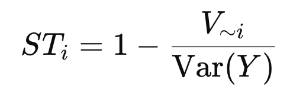
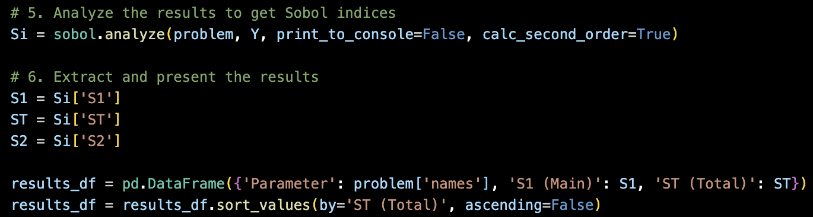

Source: [https://jeffdissel.tistory.com/218](https://jeffdissel.tistory.com/218)

우리가 하고자 하는 것은?
(where we at)
여러 변수들과 y를 도출할 수 있는 모델이 다음과 같이 있다고 가정하자.

여기서 답하고 싶은 질문:
Q. d개의 입력변수중에서 Y에 가장 큰 영향을 끼치는 친구는????
이 질문의 해답을 주기 위한 분석중 하나가 바로 우리가 이시간에 다룰
Sobol 분석
일단 핵심부터 살펴보자.
모델 출력
Y
의 변화는 여러입력의 변화들로 이루어 질 것이다.
Var(Y)
= { X1 ... Xd }모두에 의한 전체 변동
Sobol 분석은 “이 변동 중 얼마를 특정 변수
Xi ​
가 설명하는가?”를 묻는 방법
( Var(Y) 중 Xi가 차지하는 Portion은??? )
위 질문을 답하는 두가지 지수를 정의하면 다음과 같다.

다시 풀어서 설명하면,
1. Solely Xi의 Var(Y)에 끼치는 영향을 나타내는 것
-> (First - order) Si
2. 근데 생각을 해보면 Xi가 바뀌게 되면
Xj, Xk -> Var(Y) 에 주는 영향 이 바뀔 수도 있다.
따라서, 이 모든 것을 종합적으로 고려해서
Xi의 변화에 따른 Var(Y)를 계산한 지수가 바로
-> (Total Effect, STi)
예시로 설명을 해보자,
케이크의 재료에는 설탕, 달걀, 버터, 등등이 있다.
위 재료의 양에 따라 맛이 어떻게 바뀌는 지에 우리는 관심이 있다.
1차 효과 S i ​ : 설탕만 양을 바꿔볼 때 맛이 얼마나 달라지나?
총 효과 S T i ​ : 설탕을 바꾸면 다른 재료와 섞여서 맛이 달라지는 정도까지 합쳐서 본 것.
========================
이제 수학적으로 어떻게 두 지수를 계산하는 지를 살펴보자.
Anova Decompositon(분산 분해)

X1, .. Xd모두 독립이라는 가정하에 다음과 같이 분해가 가능하다.

1. First order Sobolv - var(Y)중에서 Xi가 변할때 Y의 변하는 정도 (Vi)의 비율.

Vi를 자세하게 나타내면,
E(Y|Xi) 는 정확히 Xi를 고정했을때, Y의 평균을 의미한다.
e.g.)
Y =
X 1 ​ +
X 2 ​ ,
E[Y∣X1] = X1+E[X2]
여기서 Var Xi ()는 Xi가 바뀔때, 괄호값이 얼마나 변동하는 지를 나타낸다.
따라서, 잘 생각해보면, Y의 평균값(xi고정)이 Xi에 따라서 얼마나 바뀌는지를
나타내는 것이므로, 우리가 구하고 싶은 first order의 정의와 상응한다.
2. Total effect Sobolv
algorithm: Xi가 하나도 영향을 주지 않는 variance를 구하고, 여집합으로 빼준다.

즉 Xi아닌 녀석들을 변동시켰을대 Y가 얼마나 바뀌는지를 나타냄.
자 위와 같이 정의하였지만, 사실상 Variance는 적분을 통해서 구해야한다.

지금 우리는 discretize된 점들의 데이터만 가지고 있기 때문에, 적분을 구할 수 없으므로
대체할 방법을 찾아야 한다.
Sobol 방법론은 이 적분들을
Monte Carlo 추정
으로 바꿔 계산
즉, 무작위 샘플을 뽑아서 평균과 분산을
표본평균
으로 근사

자 마지막으로 Monte Carlo 추정방식으로 S1, ST를 도출하는 과정을 정리하고 마무리하도록 하겠습니다.
먼저 parameter sample을 뽑기 위해서 범위를 산정해줍니다.

N = 1024개의 샘플수로 설정.
saltelli.sample(problem, N) 함수에서
(d : # of parameter )
2개의 큰 표본을 제작한다. 그리고 교체행렬 까지 제작.

기존에 학습하였던 Gaussian Process Regression model에 대입하여 예상되는 output 도출

What we got from the gp_preduct_func

이제 위에서 우리가 수학적으로 설명했던 부분들이 전부 sobol.analyze 함수 안에 들어가 있다.

밑의 두가지 식을 통해서 지수들을 도출한다
(핵심 아이디어는 같고, 계산방식만 다름)

(사용하는 라이브러리 마다, 함수의 모양이 조금씩 다르지만
핵심 개념과 아이디어는 동일하다)
