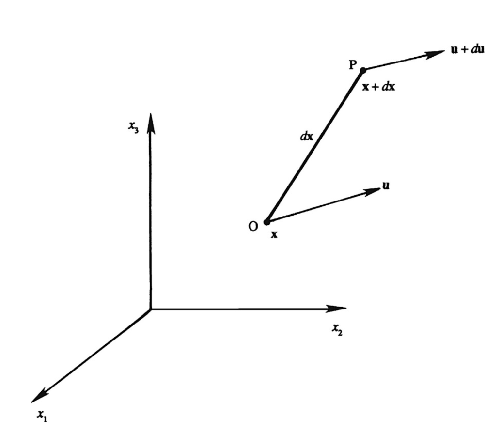

Source: [https://jeffdissel.tistory.com/m/105](https://jeffdissel.tistory.com/m/105)

Ch1. Kinematics
시작에 앞서서,
Cartesian Tensor
에 대해서
익숙해지고 들어가자.
유체의 움직임에 관한 식을
유도하는 과정에서
가장 중요한 도구인
Cartesian Tensor.
기본적으로,
i,j,k 인덱스를 사용한다.
규칙: 인덱스가 1,2,3일때를 모두 작성하고 더해주는 식이다.

index 한 종류인 경우.

위처럼, 인덱스가 두 종류가 곂쳐져 있는 경우는
먼저, 한 인덱스를 고정하고 다른 인덱스를 1,2,3대입후 더해주는 식으로 진행한다.

gradient
굉장히 많이쓰이는 gradient를 Cartesian으로 표현하면,
위와 같다.
#자주쓰이는 연산자 2가지.

i = j 가 같으면 1, 다르면 0
생각보다 단순하다.

두번째는 123 순서 기준으로 정방향이면 1, 역방향 -1,
곂치는 숫자가 존재하면 바로 0 이다.
어디다 쓰이냐는 생각이 드실 것이다.
바로 예시로 적용해보자.

curl 의 경우
Alternation tensor로
위처럼,
쉽게 표현할 수 있음을 알 수 있다.
____________________
자 이제, tensor notation을 사용하여,
유체의 motion - kinematics 를 분석해보자.

먼저, 점 0에서 p 로 미소 유체가 이동하였다고 가정해보자.
여기서, 각 1,2,3방향으로의 속도 변화량을
Velocity Gradient Tensor로 다음과 같이 표현 할 수 있다.

여기서, Velocity Gradient tensor로 두가지로 나누어 표현해보자.

나눈 이유는,
각각 term의 설명을 들으면 이해가 될 것이다.
1. Sij - Strain rate Tensor

여기서
Diagonal term
non- Diagonal term
나누어 설펴보자.
a. Diagonal term
Physical meaning
: fluid element length change 의 rate를 각 방향별(1,2,3) 별로 나타낸다.
Elongation, contraction길이를 나타낸다.

같은 방식으로 dx2 , u2를 가지고 2방향으로
유체 요소가 elongation or contraction하는 rate를 구한다면
(시간의 변화에 따른 strain)
S22가 나올 것이다.
b. Non- Diagonal term
Physical meaning
: Fluid element angular deformation rate(시간에 따른)

위의 경우, x3동일 평면에서
angular deformation rate를 다음과 같이 구할 수 있다.

결론적으로
Non-diagonal Strain rate tensor term
이 나옴을 확인 할 수 있다.
지금까지, Strain rate tensor(Sij)
에 대해서 알아보았고,

이제 Rotation Tensor(Rij)를 분석해보자.

행렬 형태로 나타내면 위와 같고,
이를 Curl(u) , Vorticity (w)로
다음과 같이 표현할 수 있다.

여기서 Rotation Tensor의 항들이 의미하는 바는.
유체 요소의
Average rotational rate on counter-clockwise direction.
아까, non-diagonal term의 angular deformation그림을 그대로 이용하자.

반시계방향으로의
Average rotation rate를 구해보면,
다음과 같이 표현 할 수 있고,
Rotation tensor의 component임을 확인 할 수 있다.

햇갈리지 말아야 할 것이 바로
Angular deformation vs Rotation 이다.
Angular deformation - Strain rate tensor (non-diagonal term)
Rotation - Rotation tensor
밑의 예시를 보면 바로 이해가 갈 것이다.

(a)의 경우 angular deformation
(b) 의 경우 Angular deformation + irrotational
(c) 의 경우 Rotational + no deformation.
(d) irrotational + no deformation.
