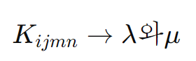
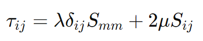
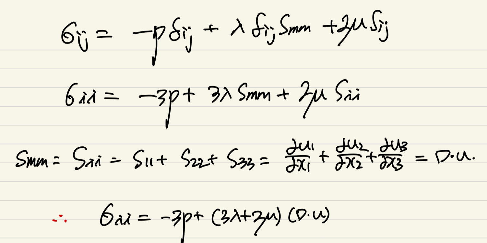
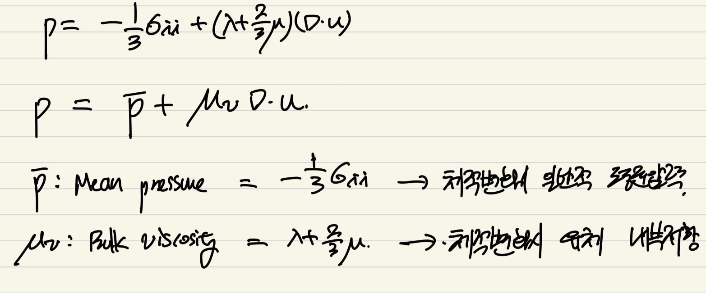
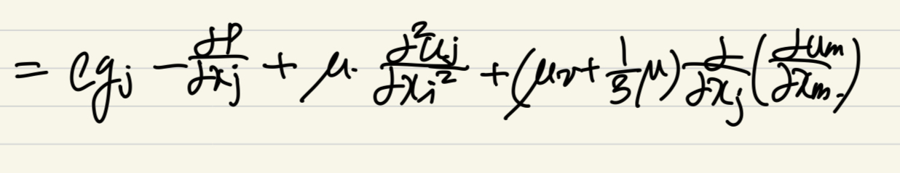
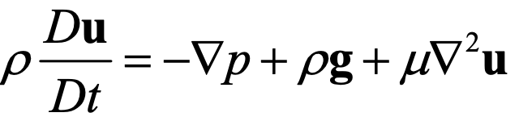

Source: [https://jeffdissel.tistory.com/107](https://jeffdissel.tistory.com/107)

[prerequisite]
https://jeffdissel.tistory.com/106
Ch2 Conservation Laws_part1
part1에서는 Ch1에서 배운 Cartesian Tensor를 사용하여유체역학 시간에 배운 Conservation of MassConservation of Momentum 을 빠르게 살펴보자. 가장 기본적인 핵심은레이널즈 수송정리 이다.https://jeffdi
jeffdissel.tistory.com
지난 포스터에서,
Conservation of Momentum
식을 정리하면서
코시방정식
까지 유도하였다.

여기서, 한 단계 더 나가는게 오늘 블로그 입니다.
핵심은 바로,
stress와 속도와의 관계식 을
유도하는 것
이다.
정지해 있는 미소유체의 경우,

X,Y,Z방향으로 압력 밖에 작용하지 않을 것이다.
하지만,
우리가 고려할 미소유체는
움직이는 경우이며
이때,
deviatoric shear stress가 발생.
(viscous stress 라고 생각하자)

먼저, 뉴턴유체 가정 으로 시작을 하면,
(Viscous stress와 Velocity Gradient tensor가 비례)
다음과 같이 식을 쓸 수 있다.

위 식에서 총 3가지 특징을 살펴보자.
1. Ch1에서 배운,
Velocity Gradient tensor
= Strain rate tensor(Smn) + Rotation Tensor(Rmn)
2. 비례상수로
K*ijmn: Viscosity Tensor로 불리고,
방향에 따라서 비례상수가 다를 수 있기 때문에 Tensor로 정의한다.
(Anistropic Fluid)
3. Rmn = 0 , why?
우리가 구하는 viscous stress는 deform에 초점을 맞추고 있고,
Rotation과는 무관하다.
여기서 Istropic Fluid 가정 을
추가하고 식을 더 정리해보면
(위 가정의 핵심은 대칭성
t12 = t21, t13 = t31 이런식으로 대칭적인 특징을 지닌다)
K를 두가지로 나눌 수 있게 된다 (대칭적이므로)

1. λ는 제1 라메상수로,
부피변화
에 대한
유체의 내부 저항성
을 나타내고,
2. u는 제2 라메상수로,
전단변형에 대한 저항성
을 나타낸다.
우리가 아는 그 viscosity 가 두번째, 라메상수이다.
최종적으로, 해석해보면
제 1 라메상수 항은
normal방향
으로의
부피 변화에 대한 내부 저항성
-> shear stress
제 2 라메상수, shear modulus는 우리가 익숙한
viscosity * shear rate tensor(elongation + angular deformation)
-> shear stress

------------------------------------------------------
조금 복잡한 개념들을 지나,
우리가 지금 뭘 하고있는지 왜 여기있는지 다시 짚고 넘어가자.
최종적으로 우리는
Stress - Velocity의 관계식
을 사용하여,

위 Conservation of Momentum 식을 속도장의 식으로 정리하고 싶다.
여기서, Stress를 압력과 deviatoric stress tensor로 쪼갠후

newtonian + Isotropic 가정 +
lama 1상수, 2상수(shear modulus) 다음과 같이 표현하였다

여기서, diagonal term을 살펴보면, 다음과 같이 정리할 수 있다.

여기서,
Mean pressure
Bulk viscosity
를 새롭게 정의하여, 식을 다음과 같이 정리한다.

왜 굳이 이렇게 정의하나 싶겠지만,
Mean pressure의 경우는 결국 유체에 작용하는 평균 압력을 뜻하고,
그와 별개인 bulk viscosity 는 위에 적힌 그대로,
체적변화에 따른 유체 내부의 저항성을 represent 한다.
#Stokes' assumption for incompressible flow
(uv = 0)
#Smm의 physical meaning

한편,

여기까지 유도한 식을
bulk viscosity, shear modulus 두개로 정리하면.

다음과 같이 정리 할 수 있다.

이제 우리가 하고 싶었던
Conservation of Momentum 식에
위의 Stress term을 대입해보자.

tensor 연산을 정리하며,
중간에 dui/dxi = dum/dxm 이기 때문에.
식이 최종적으로는

위와 같이 유도된다.
여기서 incompressible flow 가정이 추가되면,

우리가 아는 나비아 스톡스 방정식이 나오게 된다.
