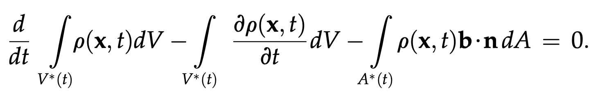
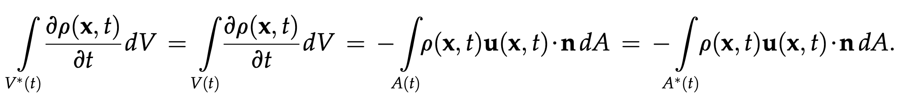
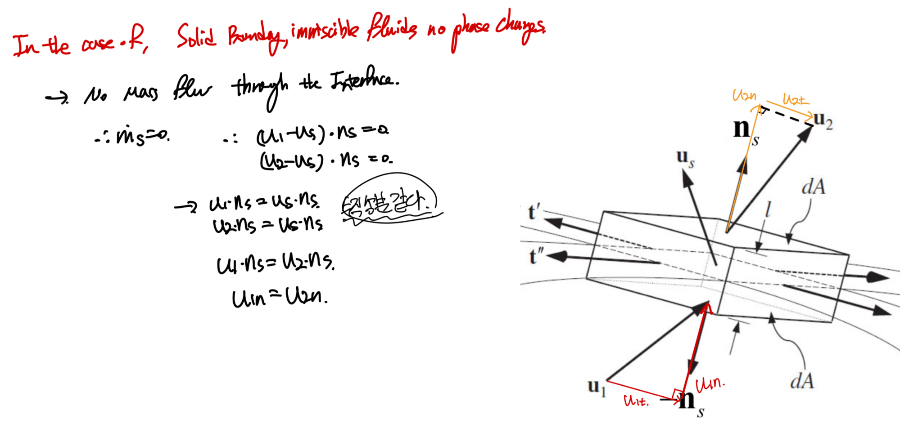
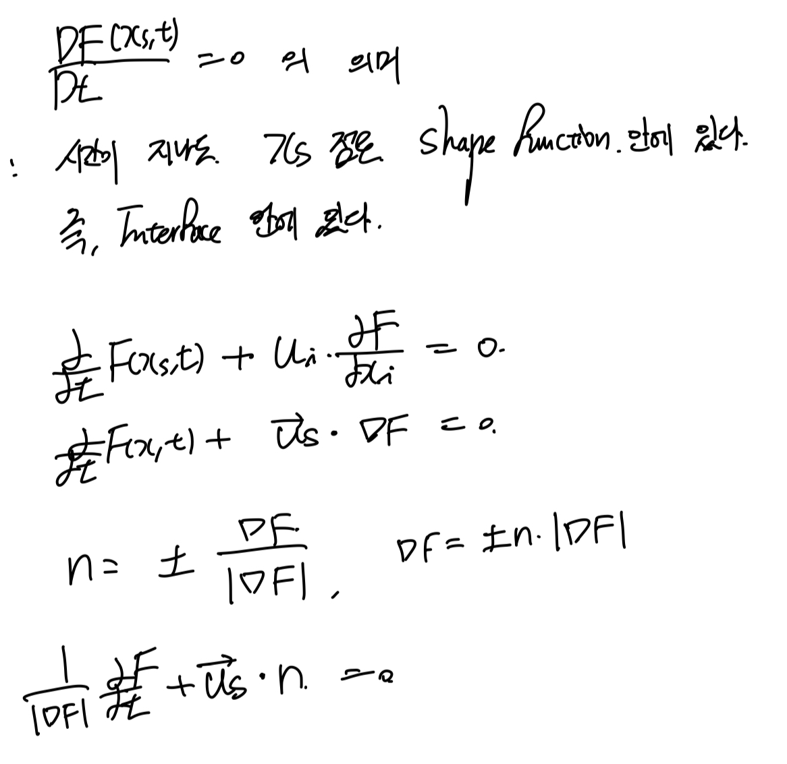
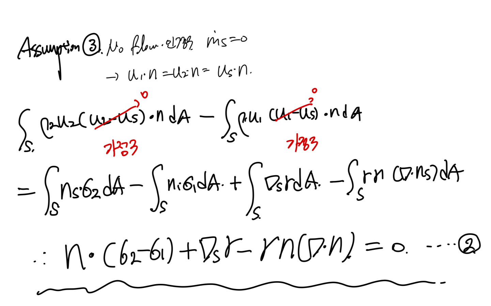

Source: [https://jeffdissel.tistory.com/m/109](https://jeffdissel.tistory.com/m/109)

Ch2 Conservation Laws_ part4 Boundary Condition
지금까지,
Cartesian Tensor를 활용한
Continuity Equation
Momentum Equation
Energy Equation
을 살펴보았고,
여기서, 우리는 어떠한 공학적 상황을
위 3가지 식으로 해석할 것이고,
그러기 위해서는 상황에 있는
Boundary condition
으로
식을 설정해주어야 한다.
지금부터,
Boundary Condition(BC)
를 어떻게 설정하는지 살펴보자.
________________________
A. General Boundary Condition at the Interface.
자 어떠한 물질 1,2 (고체든 액체든)
이 이렇게 존재한다면
반드시 만나는 면이 존재할 것이다.
그 면을 Interface라고 부른다.
먼저, conventional 한 interface를
Control volume analysis로 분석해보자.

Medium1, Medium2 사이의 아주 작은 Control volume on the interface.
t',t'': Interface 해당 지점에서 수평방향의 방향벡터 2개
ns: Interface해당지점에서 표면과 수직백터
us: Velocity of the interface
b: Velocity of control volume
u1: Velocity of Medium1 on the Interface
u2: Velocity of Medium2 on the interface
dV = l * dA
(dA: control volume의 밑면 미소면적)
(l: interface thickness)
이제, 설정한 C.V에 2가지 가정을 짚고 넘어가야 한다.
1. 두께가 굉장히 얇은 interface,
2. 굉장히, 얇기때문에
C.V input surface velocity(b1)
= C.V output surface velocity(b2)
= Interface Velocity (us)

이제,
바로 우리가 아는 Reynolds Transport Theorem(RTT) 적용해보자.
여기서 핵심 적인 것은, 움직이고 있는 Control volume이라는 것이다.
따라서, b의 속도로 움직이고 있는 v*의 유체 control volume이므로

움직이고 있는 control volume을
정지해 있는 control volume그리고, 입출입하는 유체로 분석해보면,
u(x,t) 의 속도로 유체가 입출입하는 식은 다음과 같다.

여기서, 핵심적인 것은
V(t) = V*(t)
A(t) = A*(t)
로 분석하는 것이다.
따라서, 다음 관계식이 유도된다.

이제 첫번째 식에 대입해주면,

이제 이 식에 가정들을 더해주자.

여기서, 이제 면적분을
input, output 식으로 바꾸어주자.
(u1: medium1 velocity, u2: medium2 velocity)

Case. 1 : No phase change
고체/액체,
imssicible fluids,
no phase change
(no melting, no evaporation)
인 경우,
d(ms)/dt = 0,
mass flow rate through the interface is zero

Case 2 No-slip condition
[노슬립 condition 정의]
두 물질의 interface에서
수평방향의 속도가 일정

즉, u1,u2각각 수직성분을 뺀
즉,
수평방향의 성분이 동일하다
는 식이다.
##no-slip condition은
거의 모든 interface에서
적용 되지만, 몇가지 예외가 존재한다.
1. Rarefied Gas
2. Microscopic flow
3. Superfluid with zero viscosity
4. Micro-patterned and super hydrophboic surfaces
5. Non-newtonian fluid
_________________________
B. Boundary Condition at fluid-fluid interface.
so far,
control volume analysis로
일반적인 interface를 분석하였고,
지금부터는 유체-유체로 한정하여 분석해보자.
유체-유체 boundary는 가장 큰 특징이
non-static하다는 것이다.
즉, 시간과 공간에 따라서 계속해서 변한다.
따라서, 우리는 shape function을 다음과 같이 정의하여,
시공간에 따라 어떻게 변하는지를 정의한다.
1. Shape function, F(x,t)
벡터 x = 2차원 정보(x,y)

눈치 채셨겠지만,
interface 정의가 바로
'F(x,t) = 0 을 만족하는 x들의 집합'
interface 위의 임의의 벡터(xs)의
법선 벡터는 gradient

여기서
가장 중요하고, 기본적인 식이 나온다.

혹시 까먹으신 분들을 위해서,
D/Dt 는 유체역학에서 매일 나온다
시간과 공간의 변화율을
동시에 함유하고 있다고 이해하면 편하다.

이제 Conservation of Momentum equation을
적용해보자.

여기서, 핵심은 기존의 Force term에는 존재하지 않았던,
Surface tension term이 추가된다.
surface tension(표면장력)은
쉽게 생각하면, 유체1,2가 interface에서 만나고 있을때,
interface를
유체1,2 분자들이 잡아당기는 힘의 차이에 의해 발생하는 힘이다.
위 식에서, 아주 얇은 control volume thickness 가정,
control surface velocity = interface velocity라는 가정을 추가해주면.

이후, surface tension term을 두개로 나누어 주자.

여기서,
첫번째 term은 공간에 따른 surface tension의 차이에 의한 힘.
두번째 term은 곡률에 의한 표면장력의 힘.
을 나타낸다.

term2를 자세하게 묘사하기 위해서,
직접 그려보았습니다.
밑의 그림을 보면, interface line과 tangential하게 tension이 작용함을 알 수 있습니다.
그리고 그 두 장력의 합은 -ns방향임도 알 수 있고,
그 알짜힘의 크기는 결국 곡률과 비례하다는 것을 직관적으로 확인 할 수 있죠.

여기서 이제 interface사이로
mass flow 가 존재하지 않는다는 가정을 추가해주면,

위 2번 식이 아직 다소 복잡하기 때문에,
수직, 수평성분을 나누어 분석해보자.

Medium1, Medium2 사이의 아주 작은 Control volume on the interface.
먼저 수직성분을 확인하기 위해서, n과 내적을 해주면,

여기서 만약 motion이 없는 정지한 유체라면,

(법선벡터의 gradient내적이 결국 곡률을 의미함)
압력차이와 곡률반지름,표면장력의 관계인
young-laplace equation이 derived 된다.

Medium1, Medium2 사이의 아주 작은 Control volume on the interface.
이제, 수평성분을 살펴보자 (ti = t'' or t')

여기서 Surface tension gradient가 존재하는 경우, 하지 않는 경우로 나누어 살펴 볼 수 있다.

_____________________
마지막으로, Interface control Volume을
Conservation of Energy식으로
분석해보고 마무리하자.
전개후, 가정1 얇은 thickness를 적용시켜주고,

2가지 가정을 한후, 식을 정리해보자.
가정2: no mass flow through interface
가정3: no surface tension effect

Stress analysis through conservation of Momentum

최종적으로 Continuity of heat flux 식이 나오게 된다.

