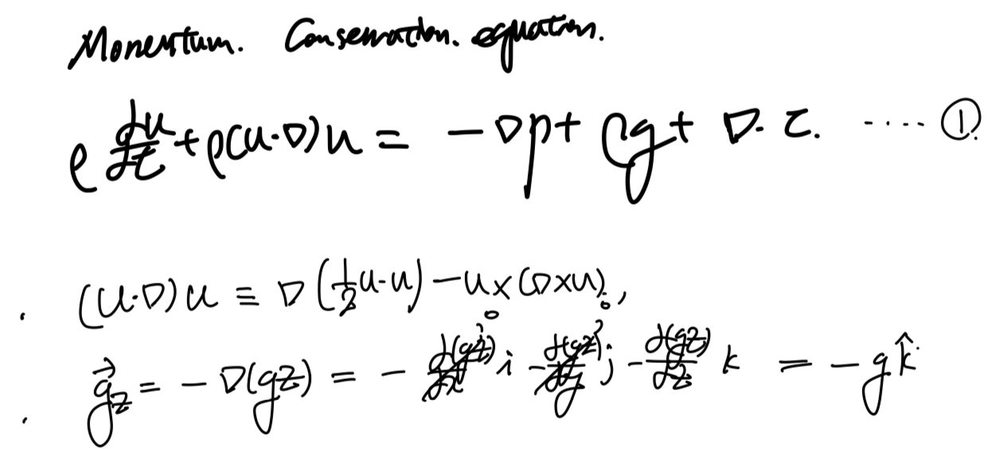
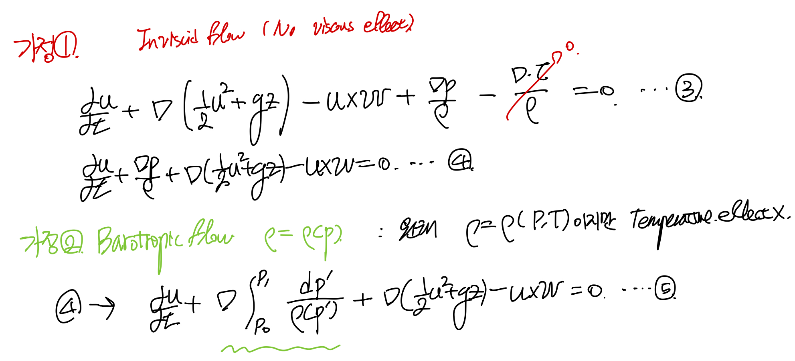
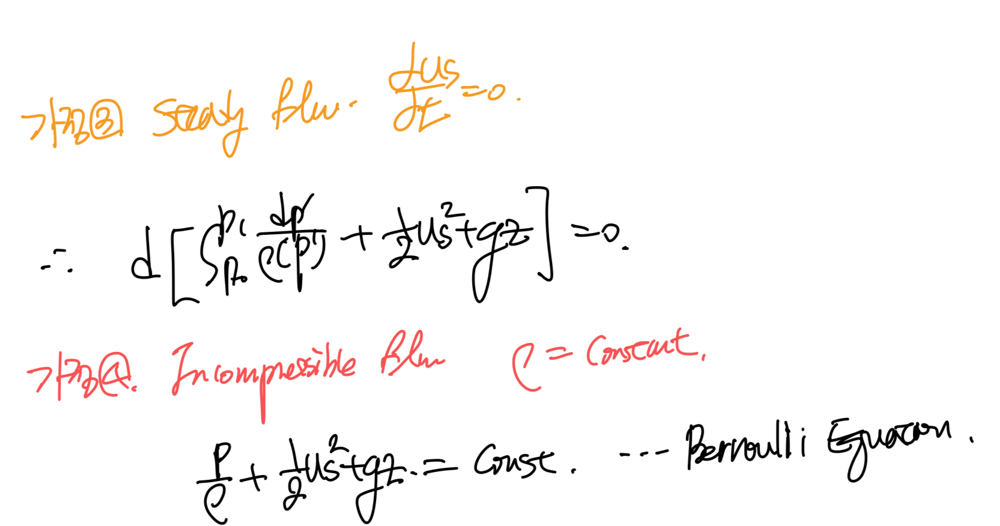
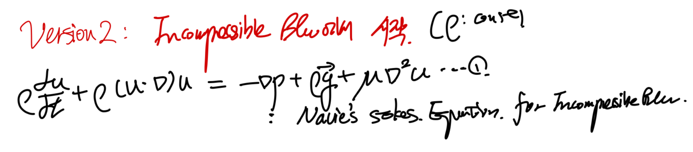
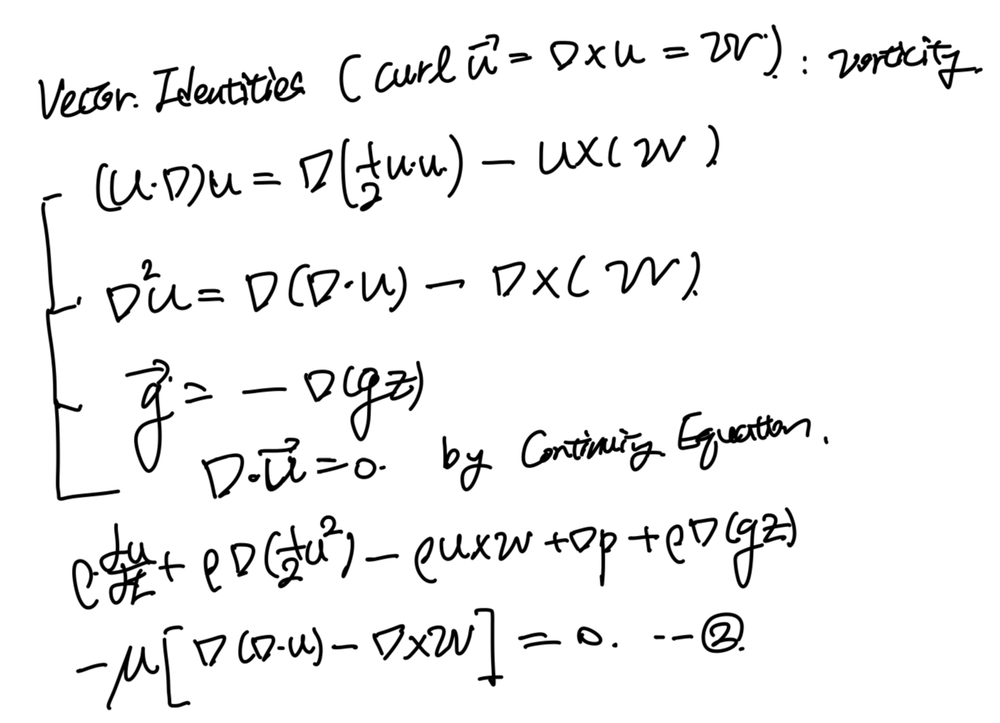
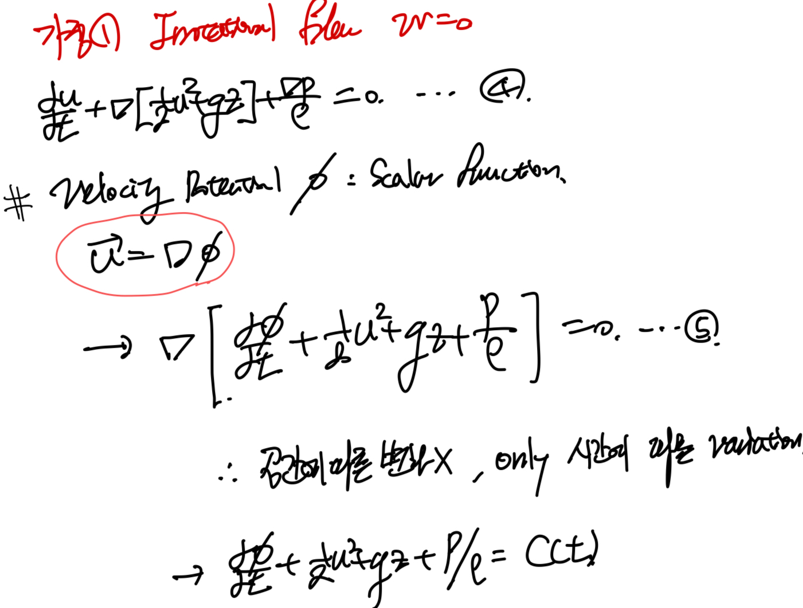
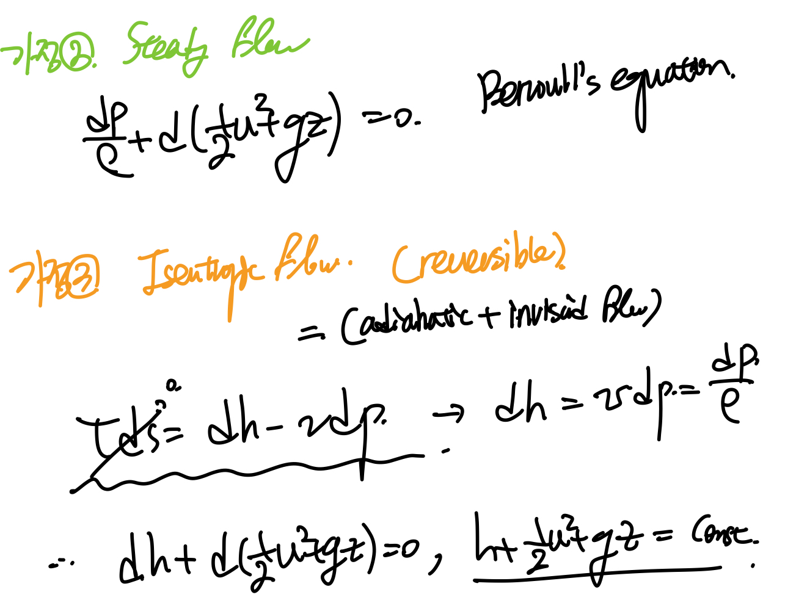

Source: [https://jeffdissel.tistory.com/m/110](https://jeffdissel.tistory.com/m/110)

Ch2 Conservation Laws_ part5 Bernoulli equation(3types)
우리가 유도하였던
Conservation of Momentum
식에
몇가지 가정을 추가해주면,
대중적으로 . 잘알려진.
Bernoulli equation이
도출된다.
여기서 가정하는 방법은 총3가지이며,
즉, 베르누이 방정식을 증명하는 방법이 3가지이다.
한개씩 직접 증명해보자.
_________________________
Case1.
먼저 conservation of Momentum 식부터 시작한다.

여기에서 위의 vector 성질과,
gravity acceleration vector를
gradient로 표현해주고 대입해준다
-> 식2 도출

식을 정리해주면,
식3으로 정리되고
여기에 두가지 가정을 해주자.
가정1: 점성효과가 존재하지 않는 유동
가정2: 밀도변화 only by 압력변화

이제 식5를 streamline을 따라,
선적분을 진행해준다.
즉, 3차원 형태의 tensor를
1차원으로 바꾸어 주자
가장 중요한 것은
Streamline은 정의가,
속도 vector와 평행한 ds를
연속적으로 연결하여(선적분을 통해)
path를 그린 것이다.

여기서 stream line의 특징에 의해서,
7번 - u,w의 외적은 u, dx 둘다와 수직이다. 따라서, 내적 = 0
8번 - 임의의 scalar function G에 대해 graientG dot ds = dG
6번식을 9번식으로 바꾸어 줄 수 있다.

여기서,
시간에 따라 fluid property가 변하지 않는 Steady flow,
밀도가 일정한 incompressible flow
가정을 추가해주면,
우리가 아는 베르누이 방정식이 도출된다.

정리해보면, 1번 방법에서는
일반적인 Momentum Conservation equation
으로 시작하여,
총 3가지 가정을 하였다.
- inviscid flow
- Barotropic flow-> Incompressible
-Steady flow
_________________________
Case2.
이번 케이스는
Momentum conservation - incompressible flow가정
을 한 Navie's stokes equation에서 시작한다.
(시작부터, 밀도 일정 가정)

여기에 vector 성질, g를 그레디언트로 전환,
그리고 Continuity eq으로 gradient dot u = 0을 통해서
식2를 도출 할 수 있다.

여기서 간단하게 밀도로 전부 식을 나누어 주면, 식3도출

여기서
Irrotational가정
을 추가해주자.
(w = curl u = 0)
+ gradient를 합치기 위해서, Velocity potential을 사용해주자.

마지막으로, 시간에 따라 성질이 일정한
Steady state flow라고 가정을 해주면,
우리가 아는 베르누이 방정식이 나온다.

정리해보면,
Incompressible flow Momentum conservation Eq으로 시작하여,
총 3가지 가정으로 베르누이 방정식을 유도하였다.
-Incompressible flow
-Irrotational flow
steady flow
1번 방식과 차별점은
Inviscid flow -> irrotational flow
임을 확인 할 수 있다.
_________________________
Case3.
이번은 1번과 동일하게,
general momentum conservation eq
에서 시작하고,
벡터 성질, 중력가속도 그레디언트로, curl u = w 를 이용하여
2번 식을 유도해보자.

여기에 이제 inviscid flow
비점성 유동 가정 으로 점성 term을 제거한후,
streamline integral 을 진행해주자.

4번 식에서
Steady-state flow assumption
을 해주면,
베르누이 방정식 등장.

추가로,
Isentropic flow 가정
을 해주면 (단열, 비점성 유동)
h + 1/2 u^2 + gz = const
식이 도출된다. h는 여기서 엔탈피이다.
즉,
베르누이방정식 도출 방법은
General momentum conservation Eq
에서
-Inviscid flow
-Steay flow
두가지 가정만 존재한다.
핵심은 유일하게
-incompressible flow
-compressbile flow
모두 적용이 가능한 방법이다.
