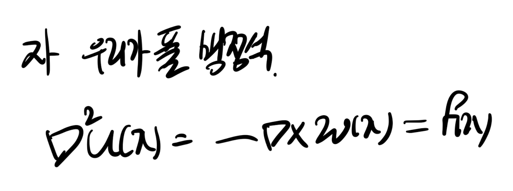
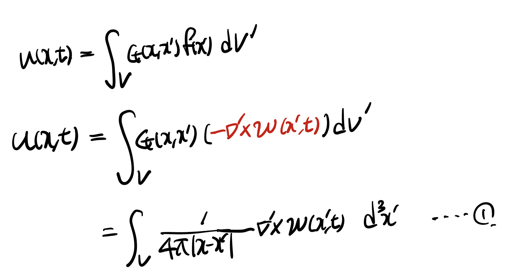
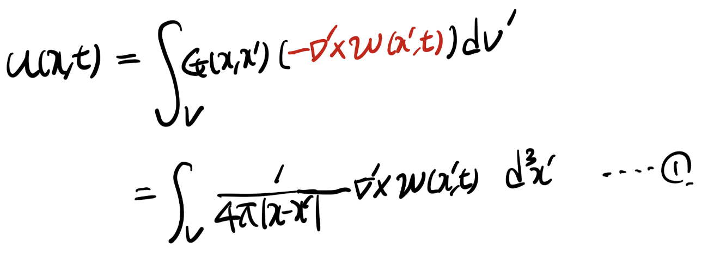
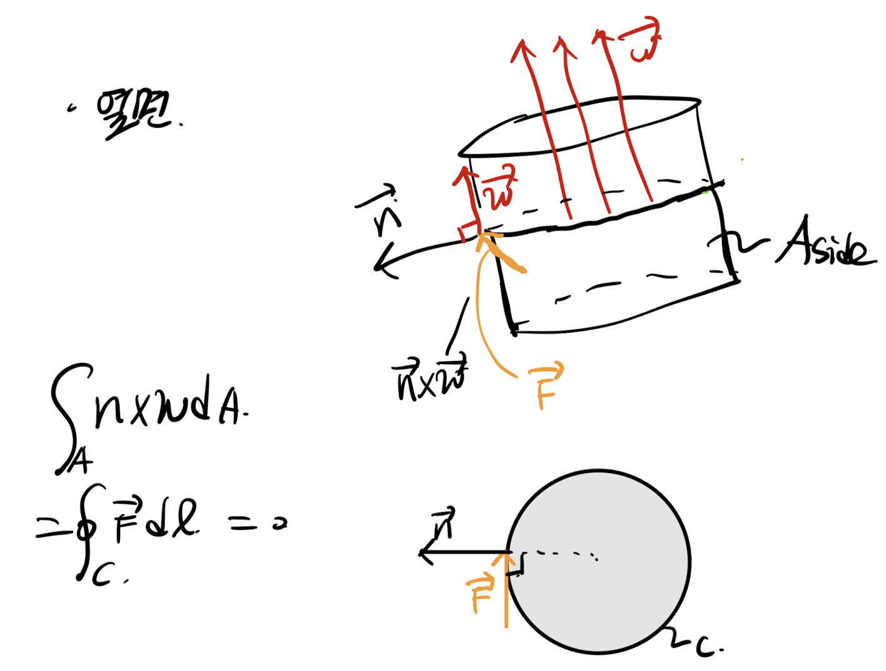

Source: [https://jeffdissel.tistory.com/m/119](https://jeffdissel.tistory.com/m/119)

Ch3 Vorticity dynamics_ Biot-Savart Vortex induction law(2)
이전 포스터를 . 꼭 참고해주세요.
https://jeffdissel.tistory.com/118
Ch3 Vorticity dynamics_ Biot-Savart Vortex induction law(1)
여기서, 한가지 의문점이 든다. vorticity, w = curl(v)라는 것을 우리는 알고 있고, 만약에 vorticity 를 토대로Velociy(속도) 장을 구할 수 있을까?? 해답인Vorticity 와 Velocity관계식을 유도해보자. ___
jeffdissel.tistory.com
우리가 지금 하고 있는 것은,
유체공간 내에서
w(vorticity)를 통해 -> u(velocity) 유도하기
Incompressible flow 가정을 해주어,
다음 포아송 방정식의 u를 구해보자.

지난 시간의 내용의 요약은

이어서 가보시죠.
자 우리가 풀 미분 방정식으로 돌아와보면,
f(x) = - curl(w) 인 상황이다.

따라서, General solution은 지난 포스터에서 증명한 대로 다음과 같다.
+ G(x,x') 지난시간에 구한 대로 대입해주자.

여기서, Volume integral 로 표현 된 이유는,
바로, x' 이 3차원공간안을 움직이기 때문이다.
(Vortex tube 내부에 x' 이 있는 상황)

여기서 1번 식을 정리하기 위해, vector 성질을 이용하자.

위 벡터 분해를 그대로 1번 식에 대입해주면,
u(x,t) 는 다음과 같다.

여기서 빨간색으로 밑줄 처진 부분 = 0. 임을 증명하자.

위 식에서 A가 의미하는 바는 vortex tube의 모든 겉 표면이다.
따라서, Tube의 윗면 아랫면을 먼저 살펴보면
평면의 법선벡터와 w가 평행하므로,
n x w = 0

옆면의 경우,
Stoke's theorem으로 인해

n x w 면적분 =
결국 vortex tube를 위에서 봤을때,
각 단면의 경계에 tangential 한 벡터 F를
폐곡선 C로 선적분 한것과 같다.
즉, zero 이다.
결론적으로, 우항 first term = 0
따라서, 다음과 같이 표현 가능하다.

이후, 위 u(x,t)를 circulation으로 표현하기 위해
vortex tube를 원기둥으로 고려하고
(dV' = dA' dl)
+
아주 작은 segment에서 du(x,t)를 구하고 총 체적분을 해주자.

아주 작은 segment 의 특징은 x, x' 이 fixed 하다는 점이다.

이후, vortex tube 전체 적분을 해주면

최종식은 전체 vortex tube의 circulation을 통해서u를 유도한 식인것.
