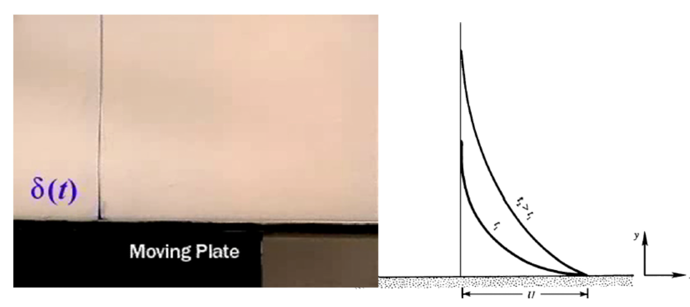
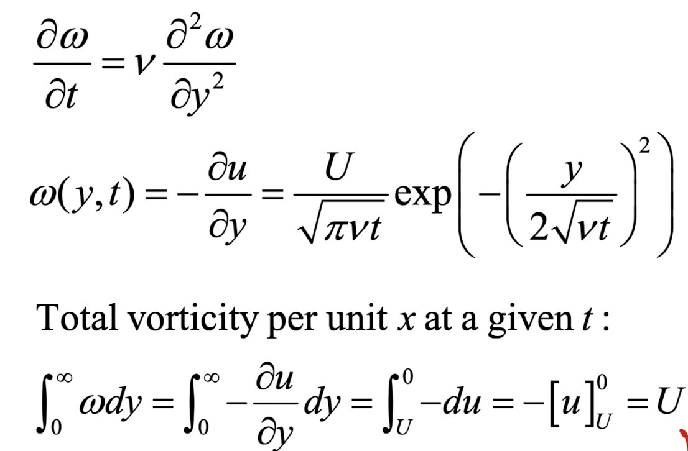

Source: [https://jeffdissel.tistory.com/m/114](https://jeffdissel.tistory.com/m/114)

Ch3 Vorticity dynamics_part3_Vorticity Equation(2)
Where r we now?
(이전포스터 보고 오셔야 됩니다..무조건)
https://jeffdissel.tistory.com/113
Ch3 Vorticity dynamics_part3_Vorticity Equation(1)
이번 시간에는,Vorticity Equation을 유도해보자. incompressible flow가정으로 Navier's Stokes Equation부터 시작하자. 1번식에 vector 분해와, 중력가속도를 백터로 바꿔준후, 1식에 대입해주자.이후,
jeffdissel.tistory.com
Vorticity Equation
을 바로 이전 포스터에서 다음과 같이 증명하였고,

이 식의 물리적 의미를 이해하기 위해서, 우항의 첫번째
Vortex tube(line)의 Stretching&Tilting
으로
Vorticity(w)
의 변화를
증명하였다.
이제 두번째 2항의 물리적 의미
Diffusion of vorticity
를 살펴보자.
________________________
위를 정확히 이해하기 위해서
Diffusion Equation을 이해하고 가자.
1차원에서 다음과 같은 상황을 가정해보자.
c: 농도

A->B로 입자들이 이동할 것이고,
그 이유는
dc/dx<0 (0이 아니기)
때문이다.
그렇다면, 입자의 이동 정도를 어떻게 표현할까?
바로
Flux(J)
:단위시간당, 단위면적을 통과하는 입자의 양

당연히 J는 입자의 양의 차이(
∇
C)
과 비례할 것이고,
비례상수는 Diffusivity, D로 정의한다.
[단위: m^2/s]
dc/dx <0 인 방향으로 입자들이 흘러가기 때문에,
- 를 씌워준다.
최종적으로 위에 적힌 식이 바로 Fick's Law
____________
여기서 한 스텝 더 나아가서,
∇ ⋅ J
[divergence of Flux]
가 무엇을 의미할까???
먼저, divergence of V 는 스칼라 이며
∇ ⋅V
[임의의 vector V]
어떠한 좌표 x,y,z에서
그 벡터가 좌표로부터 발산하는 양을 나타낸다.
_______________
ex)
어떠한 좌표의 점 - 유체입자
V - 유체 입자의 속도 벡터
라고 생각을 해보면,
유체입자가 그 공간(좌표)에서
퍼져나가는 정도를 뜻하는 것이
바로
∇ ⋅V
_______________
다시 본론으로 돌아와서
∇ ⋅ J
이 의미하는 것은?
어떠한 특정 좌표(공간) 에서
밖으로 나가는 물질의 총량
(J: 물질이 퍼져나가는 방향과 정도(벡터))

발산량을 정확히 수식으로 이해해보자.
밑의 그림처럼, 각 방향으로 물질들이 들어오고 나가는 상황

여기서, x 방향으로 들어오고 나가는 총량을 먼저 구하고
이제, 모든 방향에서 들어오고 나가는 총량을 구해보면,

divergence of J *(dxdydz)
이 단위시간당 아주 작은 공간의 물질의 변화량
을 나타낸다.
이 단위시간당 아주 작은 공간의 물질의 변화량
= dc/dt *dV (dV =dxdydz)
로 그저 명시된 정의에 따라서 자명하게 표현할 수 있다.

이를 정리하면,
확산방정식 (Diffusion Equation)이 도출된다.

이 방정식이 의미하는 것을 정리해보면,
1. 각 공간(좌표)마다 C(농도)가 다르기 때문에,
(Gradient of C 존재, 궁극적인 확산의 시발점)
2. Flux(J)가 생기고
(입자의 흐름이 생긴다고 이해하면 편하다)
3. 공간을 입출입하는 총 물질의 양 존재.
as ∇.J
4.위 계산한 발산량 = 단위시간당 공간의 농도 변화량.
4번 방정식이 바로 우리가 증명한
확산방정식인 것이다.
________________________
입자의 확산, 열의 확산, 점성의 확산
모두 같은 mechanicsm임을 아래 식들로 확인 할 수 있다.

_______

Vorticity Eq.
결론적으로, 우리가 알고 싶었던 Vorticity EQ의 두번째항의 의미는

즉 공간마다, w가 달라서, gradient W가 존재할 것이고,
이로인해서 Viscous diffusion of W가 존재하는 것.
Viscous diffusion of velocity
예시를 살펴본후, vorticity를 살펴보자.
아래 그림에서 판이 정지해 있는 상황에서,
(분홍색 - 유체)도 당연히 속도 =0 일 것이다.

여기서,
plate가 오른쪽(+x) 방향으로 움직여보자.
plate바로 위에 있는 유체들은 plate에 의해 오른쪽으로 속도를 얻을 것이다
However,
유체의 아주 큰 특징인
점성
으로 인해서
판 바로위의 유체들은 그 위의 유체입자들의 속도를 증가시킨다.
이런식으로 한층은 . 그위층을 또 . 그위층을
시간이 흐름에 따라 속도를 계속해서 증가시킨다.
이를 오른쪽 그래프로 살펴보면,
점성에 의한 속도의 y방향 확산으로 나타낼 수 있다.
이를 식으로 표현하면, 다음과 같고 ODE의 해도 유도할 수 있다.

이를 똑같이 Viscous Diffusion of Vorticity에 적용시키면 다음과 같다.

