Source: [https://jeffdissel.tistory.com/134](https://jeffdissel.tistory.com/134)

https://jeffdissel.tistory.com/133
Ch5 Low Reynolds number flow - Stokes Flow part2
https://jeffdissel.tistory.com/132 Ch5 Low Reynolds number flow - Stokes Flow part1ch4에서는Laminar flow,흐름이 uniform한 유체의흐름에 대해서 다루어 보았다. 이번에는Reynolds number 인 상황에서 유체의 흐름이 어떤
jeffdissel.tistory.com
지금 현재, Reynolds 수가 매우 낮은
Stokes flow가
구의 주변에서 어떻게 흐르는지,
속도장까지 analytical solution으로
지난시간에 유도하였다.
핵심적인 가정은 바로: Axisymmetric flow 라는 것.

Stokes flow over the sphere configuration.

지난 포스터에서 구한 spherical coordinate 속도장. a: 구의 반지름.
지난시간 속도장을 어떻게 구했는지, 짧게 요약해보면,
먼저 Stokes flow의 성질로 NS식에서, 관성항을 소거해준후,
derive된 방정식의 속도장을 하나의 변수로 바꾸기 위해,
Stream function으로 각 속도장을 치환해준다.
이후, stream function을 구하고,
정의에 따라 각 속도성분을 구한 것.
속도를 구했으니,
이제 압력, 구에 작용하는 힘을 이어서 구해보자.
1. 압력
아주 간단하다,
연속방정식과 모멘텀 보존방정식에서 관성항을 뺀 식은 다음과 같다.
(지난 포스터에서 증명)
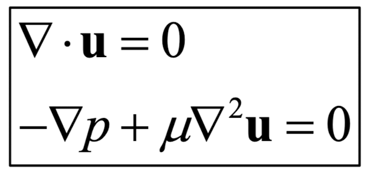
여기서 이제 속도장을 두번째 식에 대입해주기만 하면 된다.
복잡한 계산에 들어가기 전에, spherical coordinate에서
laplacian of vector and scalar를 각각 살펴보고 가자.
(햇갈리면 안된다. 벡터와 스칼라의 라플라시안은 각각 전혀 다르다)

Axissymmetric assumption으로 소거항 발생.
먼저
속도 벡터
의 라플리사안은 다음과 같다.

전개를 전쟁을 위한 총알 4발은 다음과 같다.
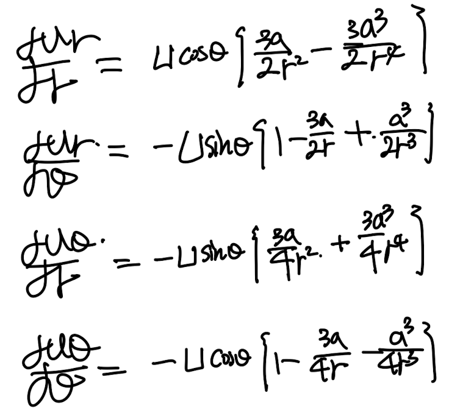
r coordinate 항을 먼저
대입해주고 전개해주면, 기가막히게 정리가 된다.;

같은 방식으로
theta coordinate도 전개해주면
기가막히게 한개 항만 남는다.

따라서, 우리가 구하고 싶은 압력의 gradient는:

여기서 압력을 r, theta로만 이루어졌으므로(axissymmetric)
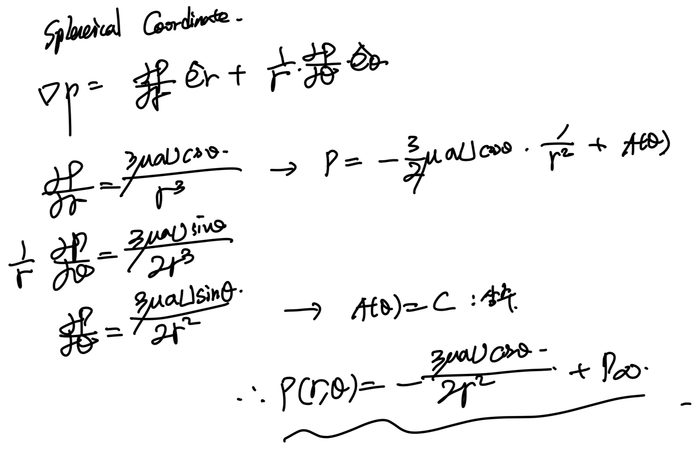
압력장을 유도 완료하였다.
속도와 압력을 알면 우리는
stress tensor를 구할 수 있다.
따라서, 구의 surface force를 유도할 수 있다는것.
2. Surface force
전체 Surface force는 surface force per unit area 를
면적분 한것으로 구할 수 있다.
우리는 Ch2에서 sufrace force가
법선벡터와 stress tensor의 내적인 것을 확인하였다.

여기서 조심해야할 것은, 법선벡터의 방향이 r방향만 존재한다는 이다
따라서, j = r으로 고정하고 남은 2항만 구하면 된다.
(아래 그림 참고)
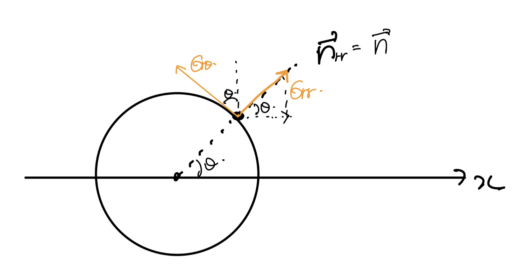
위 surface force식에서
우리는 x방향만 구할 것이다.
그 이유는 우리가 관심 있는 것은
Drag force(유체의 흐름과 반대방향, -x)
이기 때문
따라서, +x방향을 양수 기준으로
구한 두 텐서는 다음과 같다.

stress tensor를 압력과 shear stress tensor로 쪼개주자.
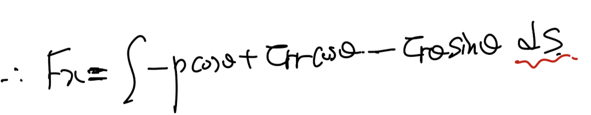
여기서 구의 부분 면적 dS를 다음과 밑의 그림을 통해,
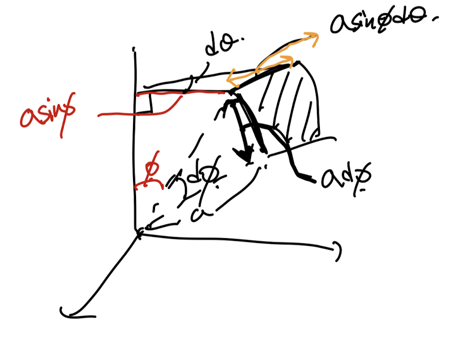
다음과 같이 표현가능하다.
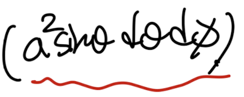
구의 부분면적 dS
바로 적용.
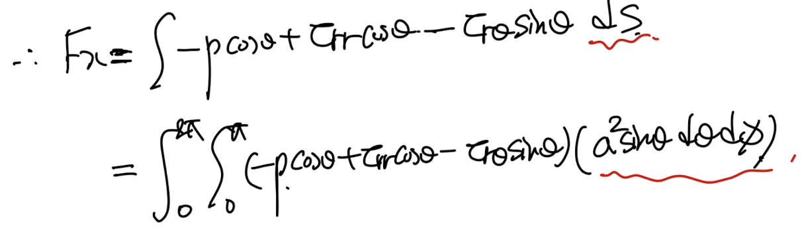
여기서 우리는 압력은 이미 알고,
속도장을 알기 때문에
shear stress tensor, normmal stress tensor
shear rate tensor로 구할 수 있다.
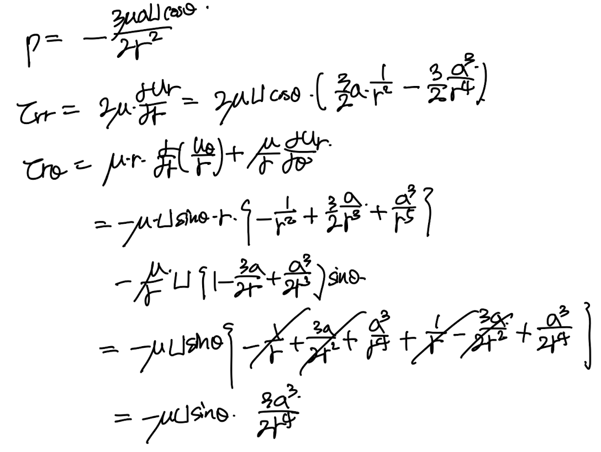
spherical coordinate stress tensor.
먼저 적분 안에, 전부 압력과 텐서를 대입해주자.

이후 적분항에 대입.
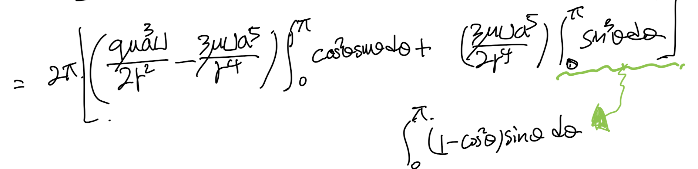
정리.

결론적으로
x direction
surface force : 6pi u U a를 유도하였다.
3. Drag coefficient
따라서, drag coefficient를 정의에 따라서 유도가능하다.

잊지 말아야 할 점은, 우리가 구한 drag coefficient 는
Stokes flow일 경우라는 것(Re <1)
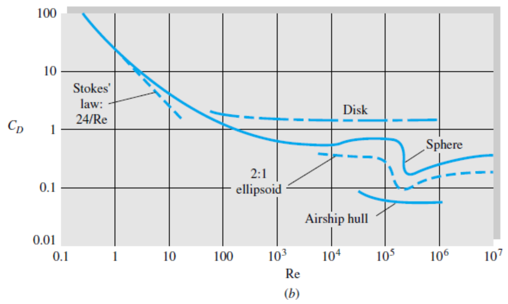
________________________
하지만
Stokes solution에는
문제점
이 있다.
바로 반지름에서 굉장히 먼 유체의 경우
속도장의 해석이 잘못됬다는 것이다

기존 stokes flow 속도성분.
위 기존 속도성분에서 r -> infinity
일때, 1/r 보다 고차원을 소거해주자.

r -> infinity일때 Stokes flow 속도장.
여기서 gradient, laplacin의 크기는 다음과 같이 표현된다.
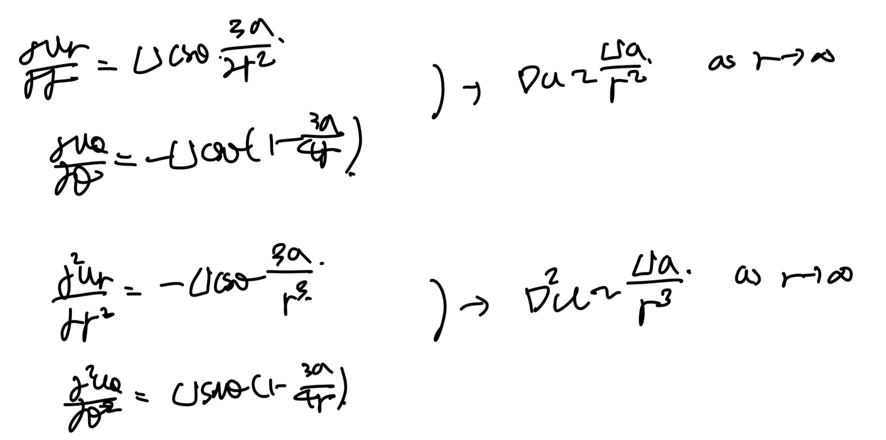
여기서 중요한것은,
위 gradient, laplacin은 각각
viscous force per unit volume, Inertia force per. unit volume
을 의미한다.
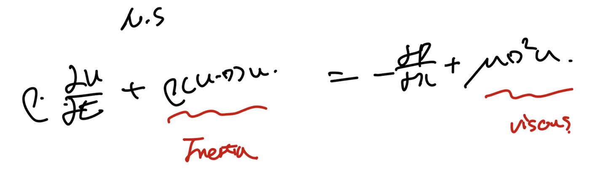
Incompressible naivers Stokes Equation.
따라서,
굉장히 구에서 먼 유체의 점성, 관성 항은 다음과 같다.

두 크기를 비교하기 위해 비율을 유도하면
r이 커질수록 관성항이 점성항보다 지배적인 것을 알 수 있다.

하지만, 생각해보면
기존 스톡스 방정식을 유도할때 우리는
관성항을 아예 소거하고, 압력과 점성항만 남겨서 계산하였다.

즉 하고 싶은 말은
r이 굉장히 큰 상황에서(구에서 멀리 떨어진 유체)
관성항을 위처럼 제거하면 안된다는 것이다.
관성항 > 점성항이므로..
이를 해결하기위한 Oseen's approximation은
Free stream 유체가 +x방향 U의 크기로 흐른다고 가정하고,
x성분 속도를 고정된 U와 fluctation 속도 u'로 분해하였다.

이렇게 정의한후, advection term을 전개해주면,

위와 같이. 무시해도 되는 항, 유지해야하는 항으로 나눌 수 있다.
따라서, 전체 momentum 보존 방정식은 관성항에서 U항이 살아난
다음 식과 같다.

이를 이제 stokes flow를 풀때와 똑같이,
Stream function의 방정식으로 바꾼후,
stream function derive
-> Velocity derive
-> Pressure derive
-> Surface force derive
-> Drag force derive
-> Drag coefficient derive
순서대로 유도하면
다음과 같다.
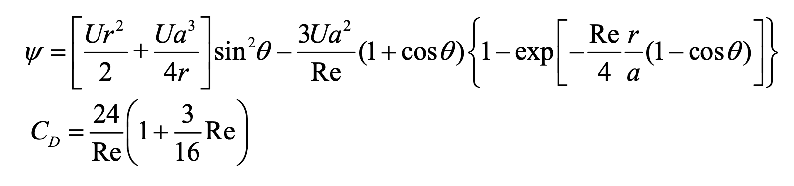
Ch5 low reynodls number는 여기까지 다루도록 하겠습니다
읽어주셔서 감사합니다!
