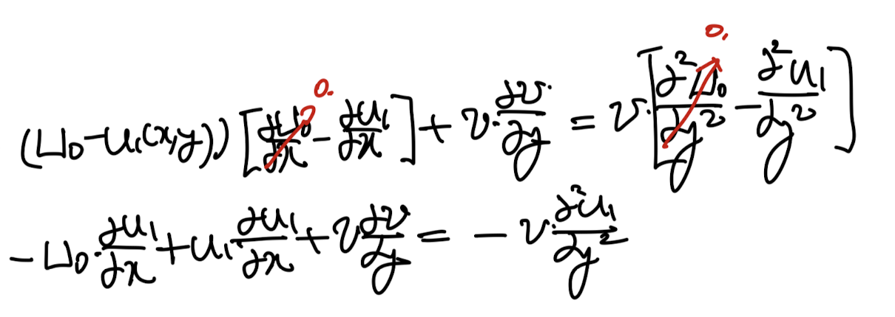
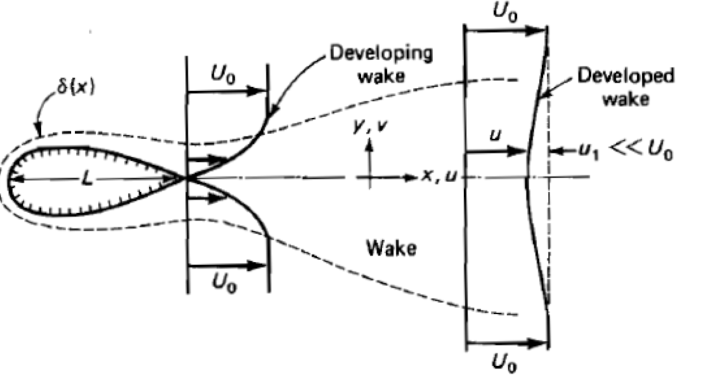
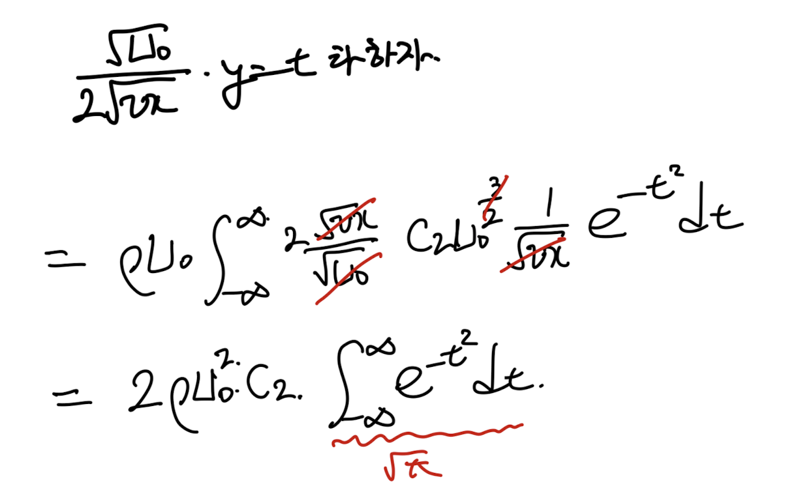
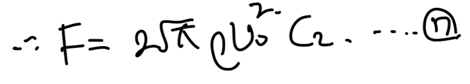
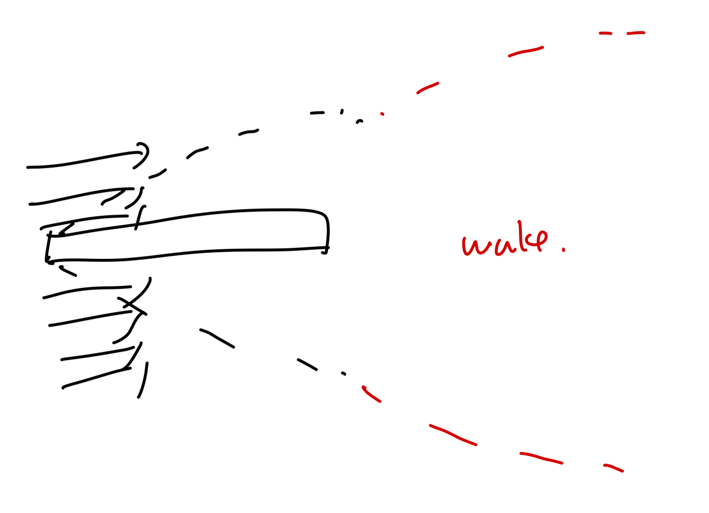

Source: [https://jeffdissel.tistory.com/m/151](https://jeffdissel.tistory.com/m/151)

Ch6 Boundary layer theory part5 - Wake
지난시간에,
boundary layer equation이 적용될수 있는
다른 상황들 중 Jet flow에 대해서 분석해보았다.
이번에는 Wake 에 대해서 분석해보자.
#Wake 란?

고체 면과 유체사이의 no-slip bc
+유체의 점성으로
free stream velocity의 모멘텀을 잃어
boundary layer가
고체 표면에 형성된다.
하지만 그 부분을 지나,
유체는 다시 free stream 유체로부터
momentum을 받아,
free stream으로 합쳐질 것이다.
그 합쳐지는 데 까지
뒷 영역을
wake(후류)
라고 정의한다.
여기서,
Wake도
u>>v 이고, du/dy, dv/dy >> du/dx, dv/dx 인 상황에서
Free stream과 속도가 변하는 부분의 경계를
boundary layer
이라고 정의하고,
boundary layer equation을 적용시킬 수 있다.

far wake of a non-lifting body.
여기서 Free stream velocity = U_0이라고 정의하고,
wake에서의 손실된 속도를 u1이라고 다음과 같이 정의하자.
(그리고 U0>> u1인 상황)

여기서 Boundary condition을 짚고 넘어가자.

이제 boundary layer equation을 적용하자.
(dUe/dx = 0)

여기에 새롭게 정의한 속도장을 대입하자.
u = U0 - u1

총 4개의 항 중에서 order of magnitude방식을 사용하면,
가운데 두항은 상대적으로 작은 값이므로 무시가능하다.

최종 4번식에서 늘 하던대로
similarity solution을 적용하자.

다음과 같이 similarirty function, variable을 define한후,
4번식에 대입하면 5번의 2nd order nonlinear ODE가 나온다.

5번 ODE가 감사하게 analytical solution이 존재한다.

6번식에 BC을 대입해주어도 되지만,
적분기호로 다소 복잡하기 때문에,
linear PDE의 성질을 사용하자.
바로, u가 PDE해라면,
du/dx or du/dy도 PDE의 해라는 것이다.

감이 안올 수 있으니 (제가 안왔었습니다.)
한번 증명해보자.

이 성질을 우리가 구한 함수 f에다가 적용해보자.

B 를 c,U0, v의 함수로 치환함(모두 어차피 상수라서 가능)
우리의 관심사인 속도장 을 구했고,
다음 관심사는 wake에 작용하는,
drag force이다.

뒷부분, Developed wake에 작용하는 drag forc는
momentum flux와 같기 때문에.

Momentum flux를 y가 -무한, 무한 인 범위에서 구해보자.

trikcy하게 u1 <<U0 이므로,
위에서 u = U0 같다고 설정하자,
그리고 u1 = U0-u로 치환해준다.

적분을 풀기위해 다음과 같이 치환해주면, 귀신같이 상수로 나온다.

따라서, 최종 drag force on the wake는 다음과 같다.

한편, 우리는 drag force -> drag coefficient
유도 가능하므로, C2와 Cd사이의 관계식 8번식이 유도된다.

그. 관계식을 그대로 7번의 속도장 식에 대입해주면,
속도장을 Drag coefficient에 관한 함수로 나타낼수 있다.(10번식)

만약에 Flat plate 가 있고,
위아래로 유체가 흐르는
다음과 같은 상황을 상상해보자.

여기서 핵심인 것은,
결국 Momentum losss는
flat plate위에서 일어난다.
즉, wake 에서 측정한
momentum flux defect로
구한 drag coefficient는
flat plat를 다 지나고, 나서의
Drag coefficient와 동일하다는 것이다.
자 그렇다면, blasisus Eq에서 우리는 한면에 대한
Drarg coefficeint = 1.328/root(Re_L)임을 증명하였다.
(길이 L인 flat plate)
하지만, 위 경우에는 위 아래로 drag가 작용하기 때문에 2.656으로 설정한후,
10번 속도장 식에 대입해주자.

결론적으로 다음과 같이,
y = 0 일때 u1(x)속도 값을 유도 할 수 있다.
