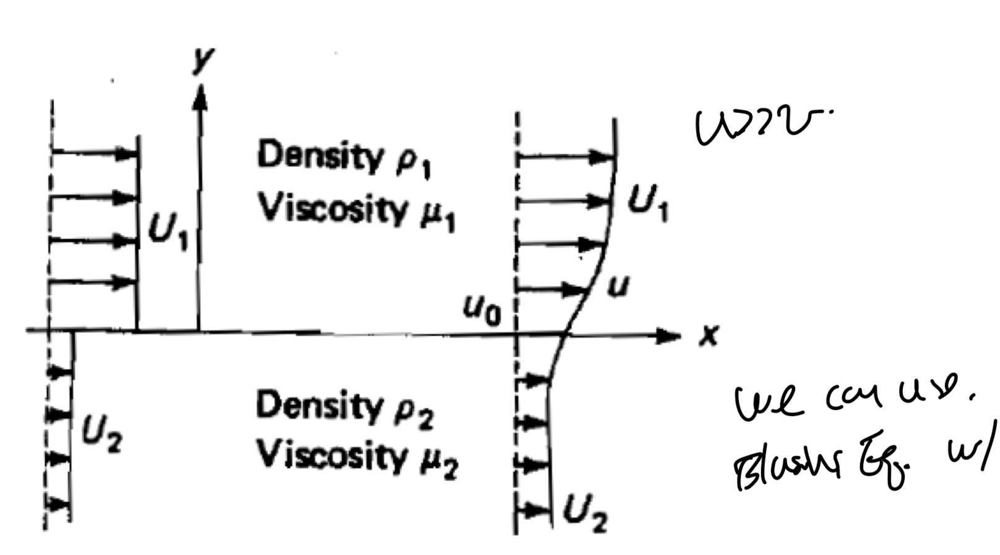
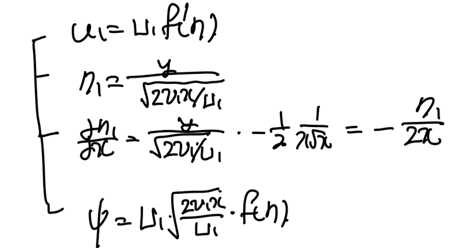
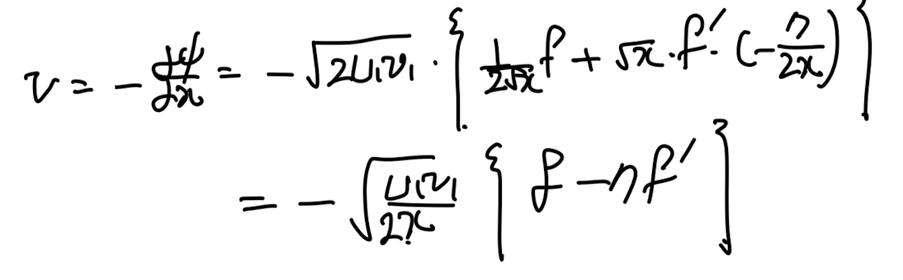
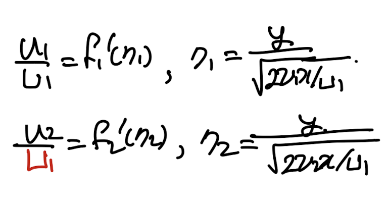

Source: [https://jeffdissel.tistory.com/152](https://jeffdissel.tistory.com/152)

마지막 case를 분석해보자.
이번에는 오른쪽으로 속도가 다른
두 유체가 흐르고 있다.
그리고 그 사이의 interface
근처에서 boundary layer가 형성 될 것이다.

우리의 목적은
boundar layer 안에서
즉, interface 근처에서의 속도장을
계산하는 것이다.
일단 u>>v, du/dy, dv/dy >> du/dx, dv/dx 가정을 통해서
bounday layer equation적용가능 함을 확인하자.

basic bondary layer eq.
이번의 경우는 독특하게,
총 두가지 종류의 유체가 존재한다.
따라서, 위 eq을 두번 작성해야한다.
그리고 각각의 속도장을 구한는 것이 최종목표이다.
각각의 경우
dU1/dx = dU2/dx = 0
이므로,
공통적으로 푸는 boundary layer eq는 다음과 같다.

이를 similarity solution으로 풀기위해
1,2번 유체 각가을 다음과 같이
similiarity function, variable을 Define하자.
(둘다 U1임을 꼭 확인하자!)

여기서
1번유체: 위 유체
2번 유체: 아래. 유체
로 편의상 설정하자.
1번 식부터 해를 구해보자.

치환한 모든 변수들을
boundary layer eq에 대입하자.

이를 2번 유체에 똑같이 적용하면
정확히 동일한 ODE가 도출된다.

ODE를 풀기 전에. 중요한
boundary condition을 확인하고 가자.

y가 무한이면, free stream이 됨.
다음 가장 중요한 interface에서의
위 아래 응력이 같아야 한다.

y방향의 변화량 >> x방향의 변화량
이 사용된다.

위 식에 우리가 정의한 similarity solution을 대입해주자.

interface의 어느 x에 대한 식이므로, x1=x2이다.

for simplicity k를 다음과 같이 치환하자.

마지막 boundary condition은
y=0 일때, u !=0 이라는 것이다.

이제 이 3가지 boundar condition을 가지고

ODE를 풀면, 다음과 같이 plot할 수 있다.
k = 무한 -> solid ,fluid interface. -> Blasius 와 비슷.

