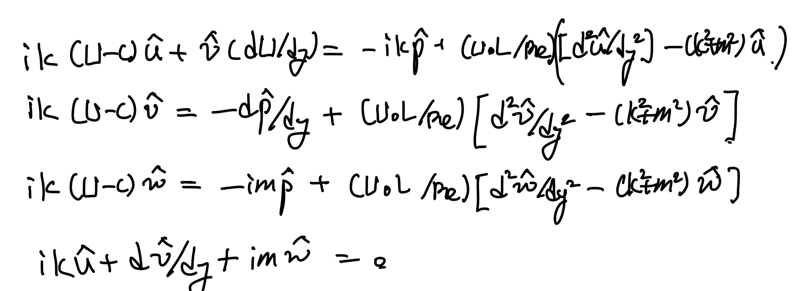
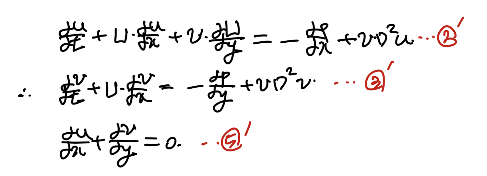
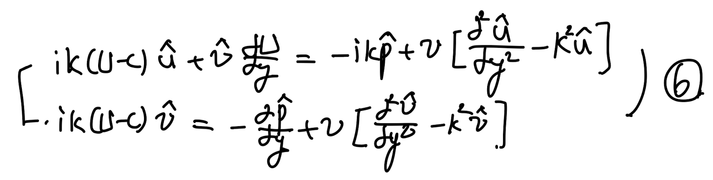
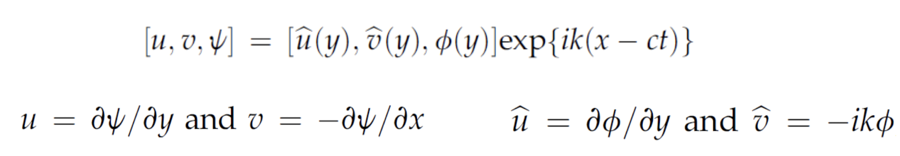
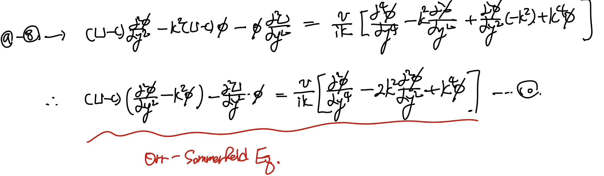
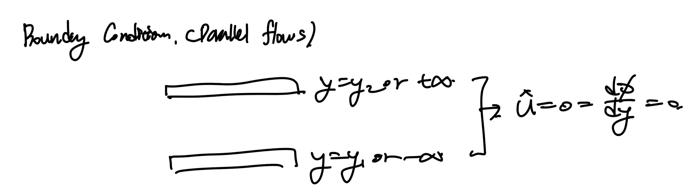

Source: [https://jeffdissel.tistory.com/136](https://jeffdissel.tistory.com/136)

지난 시간에는
Method of Normal modes
방식을 통해서,
나란히 흐르는 속도가 다른 두 유체의
interface에서의 instability
Kelvin-Helmholtz Instability
에 대해서 알아 보았다.

밑의 basic flow가 흐르고 있다고 가정하자.
(3 dimensional flow)

여기서 perturbation을
fluctation이라고 생각해보자.
(난류의 속도를 average velocity,
fluctuation velocity를 나누는 것처럼)

먼저 Basic flow를
Naviers stokes x방향 식에 대입해주면,

이번에는, perturbation을 포함한 속도장
NS x방향 식에 대입해주자.
여기서 U >> u 임을 이용하고, dU/dx = dU/dz = 0 임을 적용해주자.

+ 1번식의 을 이용하여 우항의 가운데 = 0 임을 알 수 있다.

Naviers stokes x 방향 식
같은 방식으로 y,z 방향도 진행해주자.

정리해 주면,

여기에 연속방정식 까지 진행해주자

자 지금까지, NS x,y,z 방향 식 + 연속방정식을 통해서
4가지 식을 도출 하였다.
이제 perturbation에
Method of Normal modes
을 적용해주자.
(Coefficients in governing Eq depend only on y)
(지난 시간에 배운)

Method of Normal modes assumptions
중요한 것은, 3D라는 것.
Pressure 도 perturbation이 존재한다는 것.

대입 후, 쭉 전개를 진행해주면 다음과 같다.

여기서 첫번째(x방향식)
세번째(z방향식)
을 합쳐보자.

위 Naviers stokes x,z 방향 식

여기서 다음의 치환을 해주자.

치환후 정리하면 d식이 도출된다.

여기서, 이제
y방향 식, 연속방정식도 위 치환한 항들을 대입해주면

위 치환후, 나온 식들은 모두 신기한 의미를 가지고 있다.
바로, 치환한 새로운 wave number, phase complex number를
가진 2D flow perturbation해석과
동일 하다는 것이다.

2D flow perturbation. Method of normal modes.
2D flow와 같음을 증명하기 위해서,
x,y방향 모멘텀 방정식과, 연속방정식에
위 perturbation 을 대입해주면,

2', 3' 모멘텀 방정식에 대입한 결과.
이를 정리해주면,

이는 아까 유도하였던 (x+z 식 합침)
3Dflow 식을 치환한 것과 동일함을 알 수 있다.

[Squire's Theorem]
To each Unstable 3D disturbance,
an equivalent 2D one exists at a lower Re
치환을 잘보면, 차수를 줄임으로써,
wave number는 증가하였고,
Reynolds number 는 감소하였음 알 수 있다.

따라서, Squire's theorem으로 2D
disturbances만 고려해도 된다.
자 이제 다시 정리해서 2D flow로 고려해주자.

2,3 Naviers Stokes x,y 축에 대입.

여기서 stream function도 method of normal modes로 perturbation 항 고려해주자.
Stream function coefficient로 u,v 계수를 통일해주고 6번 식에 대입해주자.

이후 7번식을 (ik)로 나누어 주자.

유도된 9번 식에서 8번식을 빼주면.
phi에 관한 식이 도출된다.
[Orr-Sommerfeld Equation]

ODE는 항상 Boundary condition을 확인해야 한다.

confined BC example. parallel two plates.
위 사진처럼 confined될 수도 있고,
한정되지 않은 무한한 flow일 수도 있다.
둘중 어느 경우든 속도(u,v)=0 ->
Φ = 0, d Φ/dy = 0

