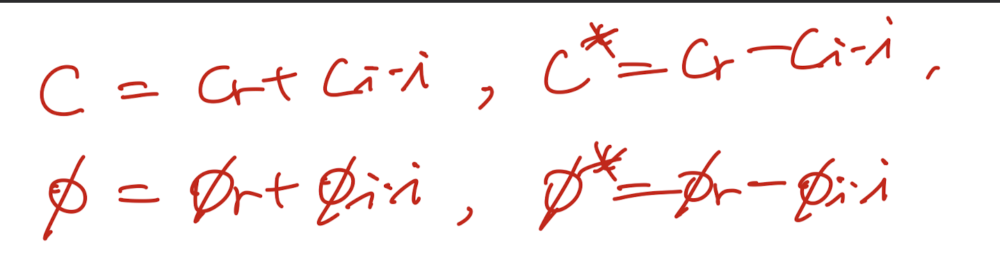
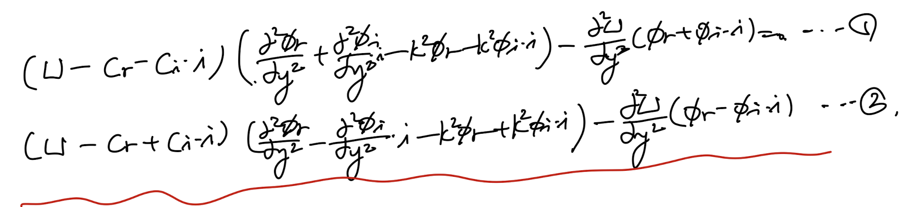
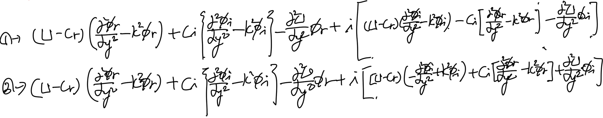
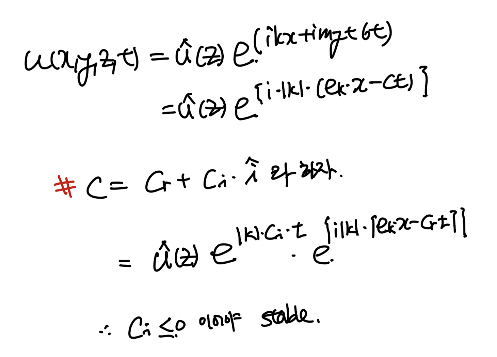
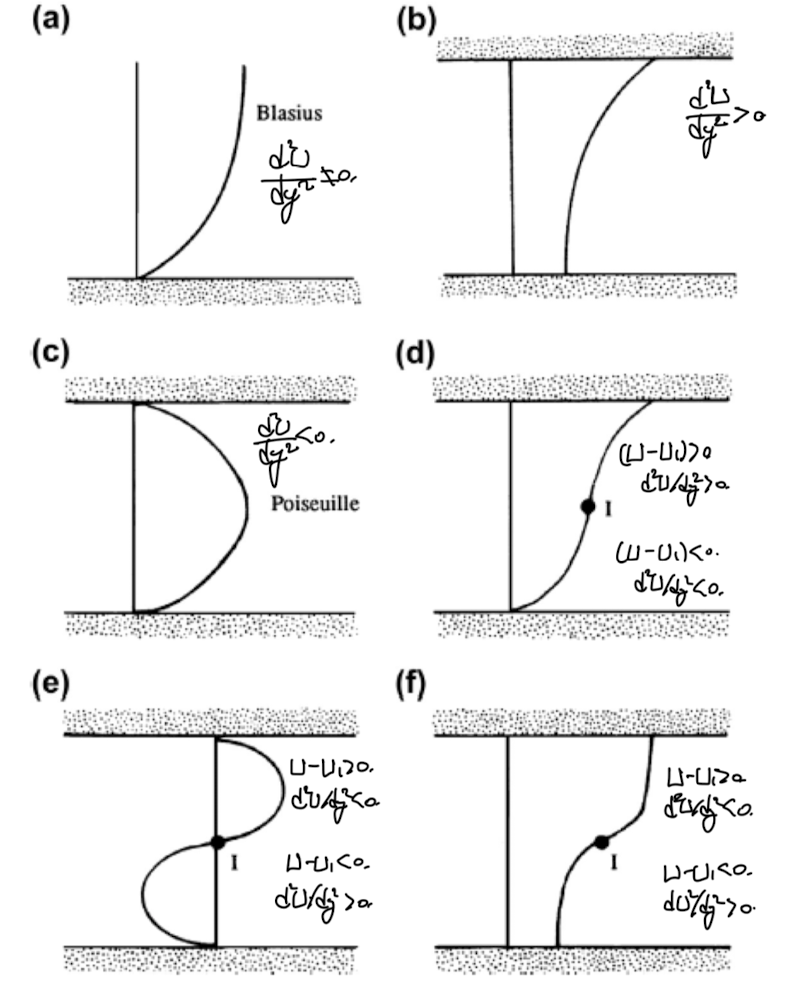

Source: [https://jeffdissel.tistory.com/m/137](https://jeffdissel.tistory.com/m/137)

Ch7 Instability 3 - Inviscid stability
지난 시간에
Squire's Theorem을 통해서
모든 3D disturbances는
2D로 전환됨을 확인하여,
2D disturbance를
method of normal modes로 가정후,
Naviers stokes 방정식에 대입후,
Stream function을 활용하여,
Orr-Sommerfeld Eq을
유도하였다.

위의 방정식을 Inviscid인 경우 해석해보자.

위 Rayleigh Eq의 경우
c, Φ 가 특정 k에 대하여 식을 만족한다고 가정하면,
complex conjugate
C*, Φ*도 위 식을 만족함을 알 수 있다.

complex conjuage pairs
진짜인지 한번 증명해보자.
각각 의 경우 를 Rayleigh Eq(10)에 대입해주자.

그리고 Real part, imaginary part로 나누어주자.

우리가 증명할 것은,
1번식 = 0 일때,
2번식 = 0 임을 보이면 된다.
1번식 = 0 ->
1번식_real part = 0,
1번식_imaginary part =0
이다.
위 전개식을 보면,
1번식_real = 2번식_real
1번식_imagine = - 2번식_imagine
이므로,
결론적으로 2번식 = 0 임을 알 수 있다.
이는 참 재밌는 사실을 함축 하고 있다.
ci < 0 인 c가 위 식을 만족하면,
Method of normal modes에서
거듭 강조했다 싶이, stable한 경우이다.

음수이면, u 가 시간에 따라서 decay -> stable
하지만 재밌게도, C의 complex conjugate(C*)도
Rayleigh Eq을 만족하는 상황이므로,
동시에 C* >0 즉, unstable한 상황이 발생한다.
따라서, inviscid 한 경우에는
Ci = 0 이어야 지만, stable하다 라고 말할 수 있다.
(to each growing mode, there is a corresponding decaying mode)
unstable 한 경우를 더 분석해보기 위해
10번식의
좌변 첫번째 항
에
Φ*를 양변에 곱해주고 적분해주자.

BC으로, d
Φ/dy = 0
(속도 = 0)임을 알 수 있다.

(여기서 d
Φ*/dy 를 변환 과정)

같은 방식으로 10번식 전체에
Φ*를 곱해주고 적분해주자.

11번 식을 잘보면, 2번째 항에 imaginary part가 숨어있음을 알 수 있다.
(by c)
추출을 위해 U-C*을 2번째항, 분모 분자에 곱해주자.

허수부분 = 실수부분 = 0 이므로,
12번식 = 허수부분 = 0 임을 알 수 있다.
12번 식을 해석해보면,

c_i가 0 이 아닐 때,
위 적분 식이 = 0 이기 위해서는
d^2U/dy^2 = 0 인 지점이 boundary안에
존재해야 한다.
그 지점이 inflection point!
이 관점이 바로,
[RAYLEIGH Theorem]
Inviscid flow 에서
inflection point가 존재하면,
unstable flow 가능성이 존재한다.
이번에는 11번식의 real part = 0 을 분석해보자.

여기서 12번식의 적분항 = 0 이므로, 14번식을 만들 수 있다.
(U1 : inflection point 근처 속도)

여기서, 13,14번 식을 더해주면,
unstable 의 새로운 조건이 탄생한다.

위 식을 분석해보면,
우리가 분석하는 boundary 안
어딘가에서는

이게 바로 [Fjortoft's Theorem]
위 theorem 을 이해시켜주는 간단한 예시를 살펴보자.

위 상황을 잘보면,
Rayleigh condition
d,e,f가 만족 하고,
Fortoft condition은
e,f가 만족함을 알 수 있다.
따라서, e,f,가 unstable의 가능성을
함축하고 있다.
(무조건 unstable은 아님, ci =0 일 수 있으니)
